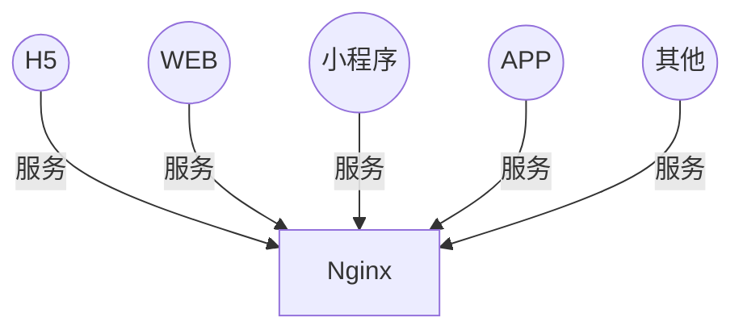
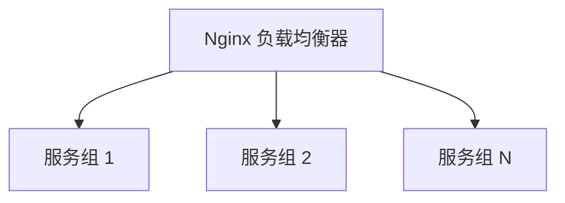
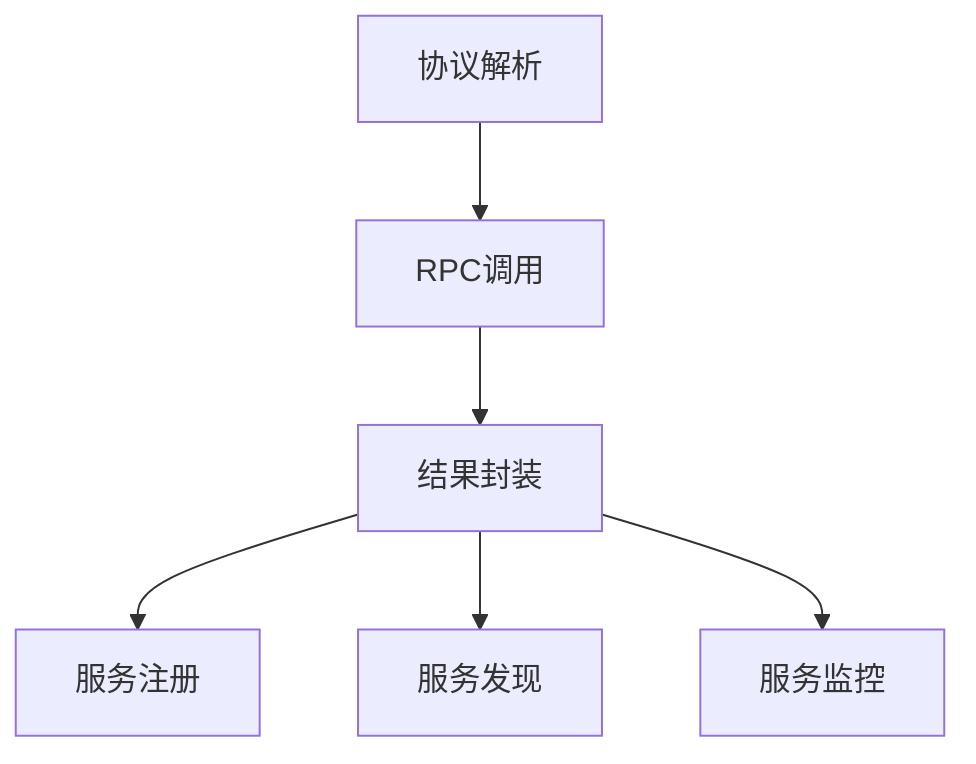
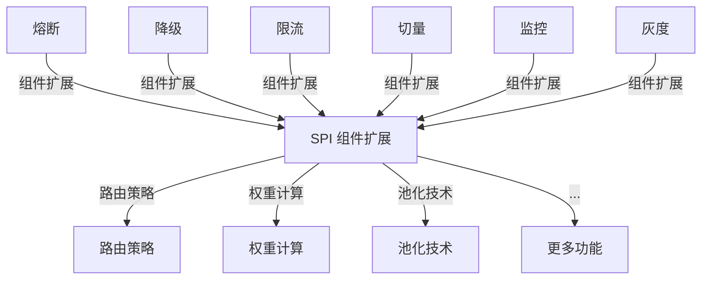
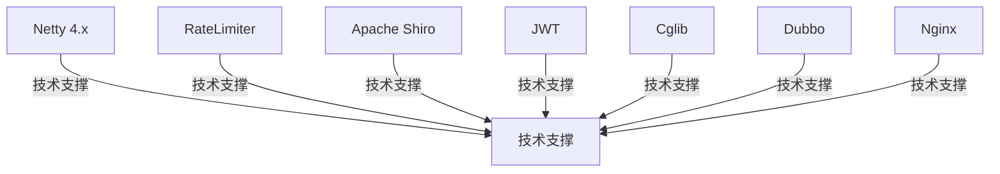
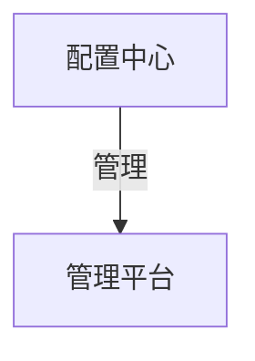
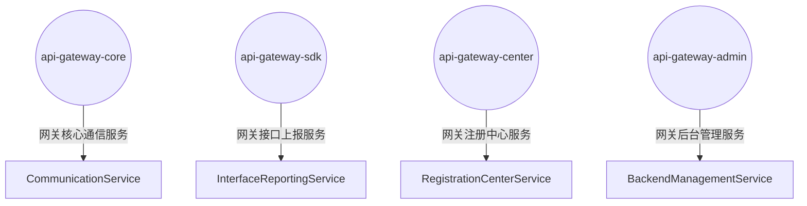
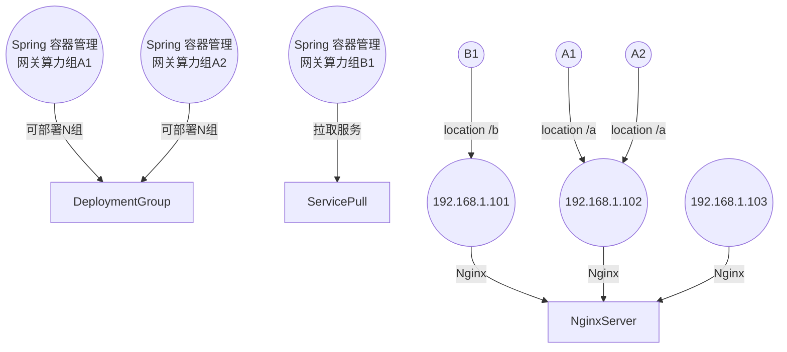

# 高性能API网关项目

## 项目简介

这是一个基于Netty和Java JUC包构建的高性能API网关，设计目标为承载百万级QPS流量，提供高可用、低延迟的服务路由能力。

## 核心特性

- **高性能**: 基于Netty异步非阻塞IO，支持百万级QPS
- **高可用**: 熔断、降级、限流等保护机制
- **可扩展**: SPI插件化架构，支持功能扩展
- **易管理**: 可视化配置管理和监控

## 系统架构

### 整体架构图



### 负载均衡层



### 通信层



### 组件层



### 技术支撑层



### 配置中心



### 服务模块



### 分布式部署



## 快速开始

### 环境要求

- JDK 11+
- Maven 3.6+
- Redis 6.0+
- MySQL 8.0+

### 安装步骤

1. **克隆项目**
```bash
git clone https://github.com/your-repo/taobao-api-gateway.git
cd taobao-api-gateway
```

2. **配置数据库**
```bash
# 创建数据库
CREATE DATABASE api_gateway;

# 执行SQL脚本
mysql -u root -p api_gateway < docs/sql/init.sql
```

3. **配置Redis**
```bash
# 启动Redis服务
redis-server

# 测试连接
redis-cli ping
```

4. **编译项目**
```bash
mvn clean compile
```

5. **启动服务**
```bash
# 启动核心服务
mvn spring-boot:run -pl api-gateway-core

# 启动管理后台
mvn spring-boot:run -pl api-gateway-admin
```

### 配置说明

#### 核心配置 (application.yml)
```yaml
server:
  port: 8080
  
spring:
  datasource:
    url: jdbc:mysql://localhost:3306/api_gateway
    username: root
    password: your_password
    
  redis:
    host: localhost
    port: 6379
    password: your_redis_password
    
netty:
  boss-threads: 1
  worker-threads: 16
  backlog: 1024
  
gateway:
  rate-limit:
    enabled: true
    qps: 10000
  circuit-breaker:
    enabled: true
    failure-threshold: 10
    timeout: 60000
```

## 功能特性

### 1. 路由转发
- 支持多种路由策略：轮询、权重、最小连接数
- 动态路由配置，支持热更新
- 路径匹配和参数提取

### 2. 限流熔断
- 令牌桶限流算法
- 熔断器模式保护
- 支持按用户、IP、接口限流

### 3. 认证授权
- JWT Token验证
- OAuth2集成
- API Key管理

### 4. 监控统计
- 实时QPS监控
- 响应时间统计
- 错误率告警

### 5. 配置管理
- 可视化配置界面
- 配置版本管理
- 配置热更新

## API接口

### 路由配置接口

#### 添加路由
```http
POST /api/routes
Content-Type: application/json

{
  "path": "/api/users",
  "target": "http://user-service:8080",
  "weight": 100,
  "timeout": 3000
}
```

#### 查询路由
```http
GET /api/routes?path=/api/users
```

#### 删除路由
```http
DELETE /api/routes/{id}
```

### 限流配置接口

#### 设置限流规则
```http
POST /api/rate-limits
Content-Type: application/json

{
  "path": "/api/users",
  "qps": 1000,
  "burst": 2000
}
```

### 监控接口

#### 获取性能指标
```http
GET /api/metrics
```

响应示例：
```json
{
  "qps": 15000,
  "avgResponseTime": 5.2,
  "p95ResponseTime": 12.5,
  "errorRate": 0.01,
  "activeConnections": 1250
}
```

## 性能测试

### 压测工具
- **wrk**: 高性能HTTP压测
- **JMeter**: 复杂场景压测
- **Apache Bench**: 简单HTTP压测

### 压测命令
```bash
# 使用wrk进行压测
wrk -t12 -c1000 -d30s http://localhost:8080/api/test

# 使用ab进行压测
ab -n 1000000 -c 1000 http://localhost:8080/api/test
```

### 性能目标
- **QPS**: 100万+
- **响应时间**: P95 < 10ms
- **错误率**: < 0.1%
- **CPU使用率**: < 80%
- **内存使用率**: < 80%

## 部署指南

### 单机部署
```bash
# 打包
mvn clean package -DskipTests

# 运行
java -jar api-gateway-core/target/api-gateway-core.jar
```

### 集群部署
```bash
# 使用Docker Compose
docker-compose up -d

# 使用Kubernetes
kubectl apply -f k8s/
```

### 配置建议
- **CPU**: 16-32核心
- **内存**: 32-64GB
- **网络**: 万兆网卡
- **JVM堆内存**: 16-32GB

## 监控告警

### 监控指标
- QPS (每秒请求数)
- 响应时间 (平均、P95、P99)
- 错误率
- 连接数
- 内存使用率
- CPU使用率

### 告警规则
- QPS > 80万
- 响应时间 P95 > 50ms
- 错误率 > 1%
- 内存使用率 > 85%
- CPU使用率 > 90%

## 故障排查

### 常见问题

1. **高延迟问题**
   - 检查后端服务响应时间
   - 检查网络连接
   - 检查线程池配置

2. **内存溢出**
   - 检查JVM堆内存配置
   - 检查连接池大小
   - 检查缓存配置

3. **连接超时**
   - 检查后端服务状态
   - 检查网络连通性
   - 检查超时配置

### 日志分析
```bash
# 查看错误日志
tail -f logs/error.log

# 查看性能日志
tail -f logs/performance.log

# 查看访问日志
tail -f logs/access.log
```

## 开发指南

### 项目结构
```
taobao-api-gateway/
├── api-gateway-core/          # 核心服务
├── api-gateway-sdk/           # SDK包
├── api-gateway-center/        # 注册中心
├── api-gateway-admin/         # 管理后台
├── docs/                      # 文档
├── scripts/                   # 脚本
└── tests/                     # 测试
```

### 详细设计文档
- [设计文档](design.md) - 百万QPS实现方案
- [模块设计](module-design.md) - 各子功能模块详细设计（包含负载均衡时序图）
- [系统架构](system-architecture.md) - 系统架构图和模块关系
- [项目结构](project-structure.md) - 详细的项目结构说明
- [开发排期](development-schedule.md) - 项目开发分阶段排期计划

### 扩展开发
- 实现自定义过滤器
- 添加新的负载均衡策略
- 集成第三方服务

## 贡献指南

1. Fork 项目
2. 创建特性分支
3. 提交更改
4. 推送到分支
5. 创建 Pull Request

## 许可证

MIT License

## 联系方式

- 项目地址: https://github.com/your-repo/taobao-api-gateway
- 问题反馈: https://github.com/your-repo/taobao-api-gateway/issues
- 邮箱: your-email@example.com