# 高性能API网关项目

## 项目简介

这是一个基于Netty和Java JUC包构建的高性能API网关，设计目标为承载百万级QPS流量，提供高可用、低延迟的服务路由能力。

## 核心特性

- **高性能**: 基于Netty异步非阻塞IO，支持百万级QPS
- **高可用**: 熔断、降级、限流等保护机制
- **可扩展**: SPI插件化架构，支持功能扩展
- **易管理**: 可视化配置管理和监控

## 系统架构

### 整体架构图

```mermaid
graph TD
    H5((H5)) -->|服务| Nginx
    WEB((WEB)) -->|服务| Nginx
    MiniProgram((小程序)) -->|服务| Nginx
    APP((APP)) -->|服务| Nginx
    Other((其他)) -->|服务| Nginx
```



### 负载均衡层

```mermaid
graph TD
    Nginx[Nginx 负载均衡器]
    ServiceGroup1[服务组 1]
    ServiceGroup2[服务组 2]
    ServiceGroupN[服务组 N]
    Nginx --> ServiceGroup1
    Nginx --> ServiceGroup2
    Nginx --> ServiceGroupN
```



### 通信层

```mermaid
graph TD
    ProtocolParsing[协议解析]
    RPCInvocation[RPC调用]
    ResultPackaging[结果封装]
    ServiceRegistration[服务注册]
    ServiceDiscovery[服务发现]
    ServiceMonitoring[服务监控]
    ProtocolParsing --> RPCInvocation
    RPCInvocation --> ResultPackaging
    ResultPackaging --> ServiceRegistration
    ResultPackaging --> ServiceDiscovery
    ResultPackaging --> ServiceMonitoring
```



### 组件层

```mermaid
graph TD
    CircuitBreaker[熔断]
    Degradation[降级]
    RateLimiting[限流]
    Cutting[切量]
    Monitoring[监控]
    GrayRelease[灰度]
    SPIExtension[SPI 组件扩展]
    RoutingPolicy[路由策略]
    WeightCalculation[权重计算]
    PoolingTechnology[池化技术]
    MoreFeatures[更多功能]
    
    CircuitBreaker -->|组件扩展| SPIExtension
    Degradation -->|组件扩展| SPIExtension
    RateLimiting -->|组件扩展| SPIExtension
    Cutting -->|组件扩展| SPIExtension
    Monitoring -->|组件扩展| SPIExtension
    GrayRelease -->|组件扩展| SPIExtension
    SPIExtension -->|路由策略| RoutingPolicy
    SPIExtension -->|权重计算| WeightCalculation
    SPIExtension -->|池化技术| PoolingTechnology
    SPIExtension -->|...| MoreFeatures
```



### 技术支撑层

```mermaid
graph TD
    Netty4x[Netty 4.x]
    RateLimiter[RateLimiter]
    ApacheShiro[Apache Shiro]
    JWT[JWT]
    Cglib[Cglib]
    Dubbo[Dubbo]
    Nginx[Nginx]
    TechnicalSupport[技术支撑]
    
    Netty4x -->|技术支撑| TechnicalSupport
    RateLimiter -->|技术支撑| TechnicalSupport
    ApacheShiro -->|技术支撑| TechnicalSupport
    JWT -->|技术支撑| TechnicalSupport
    Cglib -->|技术支撑| TechnicalSupport
    Dubbo -->|技术支撑| TechnicalSupport
    Nginx -->|技术支撑| TechnicalSupport
```



### 配置中心

```mermaid
graph TD
    ConfigurationCenter[配置中心]
    ManagementPlatform[管理平台]
    ConfigurationCenter -->|管理| ManagementPlatform
```



### 服务模块

```mermaid
graph TD
    APICore((api-gateway-core)) -->|网关核心通信服务| CommunicationService
    APISDK((api-gateway-sdk)) -->|网关接口上报服务| InterfaceReportingService
    APICenter((api-gateway-center)) -->|网关注册中心服务| RegistrationCenterService
    APIAdmin((api-gateway-admin)) -->|网关后台管理服务| BackendManagementService
```



### 分布式部署

```mermaid
graph TD
    SpringContainerA1((Spring 容器管理<br>网关算力组A1)) -->|可部署N组| DeploymentGroup
    SpringContainerA2((Spring 容器管理<br>网关算力组A2)) -->|可部署N组| DeploymentGroup
    SpringContainerB1((Spring 容器管理<br>网关算力组B1)) -->|拉取服务| ServicePull
    B1((B1)) -->|location /b| LocationB
    A1((A1)) -->|location /a| LocationA
    A2((A2)) -->|location /a| LocationA
    LocationB((192.168.1.101)) -->|Nginx| NginxServer
    LocationA((192.168.1.102)) -->|Nginx| NginxServer
    LocationA2((192.168.1.103)) -->|Nginx| NginxServer
```



## 项目进度

### 已完成模块

#### 第一阶段：核心基础模块 ✅
- [x] **负载均衡模块**: 支持轮询、加权轮询、最少连接数、一致性哈希等策略
- [x] **服务发现模块**: 基于内存的服务注册与发现
- [x] **限流模块**: 基于令牌桶算法的限流器
- [x] **熔断器模块**: 支持开启、关闭、半开状态的熔断器
- [x] **路由管理模块**: 支持多种路由匹配策略

#### 第二阶段：缓存模块 ✅
- [x] **缓存管理器**: 统一的缓存管理接口和实现
- [x] **一级缓存**: 基于Caffeine的高性能本地缓存
- [x] **二级缓存**: 基于Redis的分布式缓存
- [x] **二级缓存**: 整合L1和L2的二级缓存实现
- [x] **缓存配置**: 灵活的缓存配置和策略
- [x] **缓存统计**: 详细的缓存命中率和性能统计

### 缓存模块特性

#### 核心功能
- **二级缓存架构**: L1本地缓存(Caffeine) + L2分布式缓存(Redis)
- **灵活的更新策略**: 支持写穿、写回、写分配三种模式
- **丰富的驱逐策略**: LRU、LFU、FIFO、随机驱逐
- **批量操作支持**: 批量获取、设置、删除操作
- **优雅降级**: 当Redis不可用时自动降级到本地缓存

#### 性能特性
- **高并发**: 基于Caffeine的高性能本地缓存
- **低延迟**: 本地缓存命中时纳秒级响应
- **高可用**: Redis故障时自动降级
- **可扩展**: 支持集群部署和水平扩展

#### 监控统计
- **命中率统计**: L1/L2缓存命中率分别统计
- **性能监控**: 加载时间、驱逐次数等指标
- **容量监控**: 缓存大小、内存使用情况
- **操作统计**: 读写操作次数和成功率

### 待开发模块

#### 第三阶段：监控模块 🔄
- [ ] **指标收集**: 性能指标、业务指标收集
- [ ] **监控面板**: 可视化监控界面
- [ ] **告警系统**: 异常告警和通知

#### 第四阶段：管理后台 🔄
- [ ] **配置管理**: 动态配置更新
- [ ] **服务管理**: 服务注册、发现管理
- [ ] **路由管理**: 路由规则配置

#### 第五阶段：配置中心 🔄
- [ ] **配置存储**: 配置信息持久化
- [ ] **配置同步**: 多节点配置同步
- [ ] **版本管理**: 配置版本控制

## 快速开始

### 环境要求

- JDK 11+
- Maven 3.6+
- Redis 6.0+ (可选，用于二级缓存)
- MySQL 8.0+ (可选，用于配置存储)

### 安装步骤

1. **克隆项目**
```bash
git clone https://github.com/your-repo/taobao-api-gateway.git
cd taobao-api-gateway
```

2. **配置数据库**
```bash
# 创建数据库
CREATE DATABASE api_gateway;

# 执行SQL脚本
mysql -u root -p api_gateway < docs/sql/init.sql
```

3. **配置Redis**
```bash
# 启动Redis服务
redis-server

# 测试连接
redis-cli ping
```

4. **编译项目**
```bash
mvn clean compile
```

5. **启动服务**
```bash
# 启动核心服务
mvn spring-boot:run -pl api-gateway-core

# 启动管理后台
mvn spring-boot:run -pl api-gateway-admin
```

### 负载均衡模块特性

#### 一致性哈希负载均衡器
- **一致性保证**: 节点变化时只有少量请求需要重新分配
- **虚拟节点**: 支持虚拟节点，提高负载均衡效果
- **权重感知**: 支持权重感知的虚拟节点分配
- **哈希算法**: 支持MD5、SHA-256等多种哈希算法
- **监控统计**: 提供详细的负载分布和性能统计
- **自定义策略**: 支持自定义哈希键生成策略

#### 负载均衡策略对比
| 策略 | 适用场景 | 优势 | 劣势 |
|------|----------|------|------|
| 轮询 | 通用场景 | 简单、均匀 | 不考虑节点状态 |
| 权重轮询 | 节点性能差异 | 考虑节点权重 | 动态调整复杂 |
| 最少连接数 | 长连接场景 | 负载均衡效果好 | 统计开销大 |
| 一致性哈希 | 缓存场景 | 节点变化影响小 | 实现复杂 |

### 缓存模块使用示例

#### 基本使用
```java
// 创建缓存管理器
CacheConfig config = new CacheConfig("userCache");
config.setL1MaxSize(1000);
config.setL1ExpireAfterWrite(Duration.ofMinutes(30));
config.setL2ExpireAfterWrite(Duration.ofHours(2));

CacheManager cacheManager = new DefaultCacheManager(config);

// 获取缓存
Cache<String, User> userCache = cacheManager.getCache("userCache", String.class, User.class);

// 基本操作
userCache.put("user1", new User("张三", 25));
User user = userCache.get("user1");

// 使用加载器
User user2 = userCache.get("user2", key -> loadUserFromDatabase(key));

// 批量操作
Map<String, User> users = userCache.getAll(Arrays.asList("user1", "user2", "user3"));
```

#### 缓存配置
```yaml
# application.yml
cache:
  l1:
    enabled: true
    max-size: 1000
    expire-after-write: 30m
    expire-after-access: 10m
  l2:
    enabled: true
    expire-after-write: 2h
  update-mode: WRITE_THROUGH  # WRITE_THROUGH, WRITE_BACK, WRITE_AROUND
  eviction-policy: LRU        # LRU, LFU, FIFO, RANDOM
  stats-enabled: true
```

#### 性能监控
```java
// 获取缓存统计信息
CacheStats stats = userCache.getStats();
System.out.println("命中率: " + stats.getHitRate());
System.out.println("L1命中率: " + stats.getL1HitRate());
System.out.println("L2命中率: " + stats.getL2HitRate());
System.out.println("平均加载时间: " + stats.getAverageLoadTime() + "ms");
```

### 配置说明

#### 核心配置 (application.yml)
```yaml
server:
  port: 8080
  
spring:
  datasource:
    url: jdbc:mysql://localhost:3306/api_gateway
    username: root
    password: your_password
    
  redis:
    host: localhost
    port: 6379
    password: your_redis_password
    
netty:
  boss-threads: 1
  worker-threads: 16
  backlog: 1024
  
gateway:
  rate-limit:
    enabled: true
    qps: 10000
  circuit-breaker:
    enabled: true
    failure-threshold: 10
    timeout: 60000
```

## 功能特性

### 1. 路由转发
- 支持多种路由策略：轮询、权重、最小连接数
- 动态路由配置，支持热更新
- 路径匹配和参数提取

### 2. 限流熔断
- 令牌桶限流算法
- 熔断器模式保护
- 支持按用户、IP、接口限流

### 3. 认证授权
- JWT Token验证
- OAuth2集成
- API Key管理

### 4. 监控统计
- 实时QPS监控
- 响应时间统计
- 错误率告警

### 5. 配置管理
- 可视化配置界面
- 配置版本管理
- 配置热更新

## API接口

### 路由配置接口

#### 添加路由
```http
POST /api/routes
Content-Type: application/json

{
  "path": "/api/users",
  "target": "http://user-service:8080",
  "weight": 100,
  "timeout": 3000
}
```

#### 查询路由
```http
GET /api/routes?path=/api/users
```

#### 删除路由
```http
DELETE /api/routes/{id}
```

### 限流配置接口

#### 设置限流规则
```http
POST /api/rate-limits
Content-Type: application/json

{
  "path": "/api/users",
  "qps": 1000,
  "burst": 2000
}
```

### 监控接口

#### 获取性能指标
```http
GET /api/metrics
```

响应示例：
```json
{
  "qps": 15000,
  "avgResponseTime": 5.2,
  "p95ResponseTime": 12.5,
  "errorRate": 0.01,
  "activeConnections": 1250
}
```

## 性能测试

### 压测工具
- **wrk**: 高性能HTTP压测
- **JMeter**: 复杂场景压测
- **Apache Bench**: 简单HTTP压测

### 压测命令
```bash
# 使用wrk进行压测
wrk -t12 -c1000 -d30s http://localhost:8080/api/test

# 使用ab进行压测
ab -n 1000000 -c 1000 http://localhost:8080/api/test
```

### 性能目标
- **QPS**: 100万+
- **响应时间**: P95 < 10ms
- **错误率**: < 0.1%
- **CPU使用率**: < 80%
- **内存使用率**: < 80%

## 部署指南

### 单机部署
```bash
# 打包
mvn clean package -DskipTests

# 运行
java -jar api-gateway-core/target/api-gateway-core.jar
```

### 集群部署
```bash
# 使用Docker Compose
docker-compose up -d

# 使用Kubernetes
kubectl apply -f k8s/
```

### 配置建议
- **CPU**: 16-32核心
- **内存**: 32-64GB
- **网络**: 万兆网卡
- **JVM堆内存**: 16-32GB

## 监控告警

### 监控指标
- QPS (每秒请求数)
- 响应时间 (平均、P95、P99)
- 错误率
- 连接数
- 内存使用率
- CPU使用率

### 告警规则
- QPS > 80万
- 响应时间 P95 > 50ms
- 错误率 > 1%
- 内存使用率 > 85%
- CPU使用率 > 90%

## 故障排查

### 常见问题

1. **高延迟问题**
   - 检查后端服务响应时间
   - 检查网络连接
   - 检查线程池配置

2. **内存溢出**
   - 检查JVM堆内存配置
   - 检查连接池大小
   - 检查缓存配置

3. **连接超时**
   - 检查后端服务状态
   - 检查网络连通性
   - 检查超时配置

### 日志分析
```bash
# 查看错误日志
tail -f logs/error.log

# 查看性能日志
tail -f logs/performance.log

# 查看访问日志
tail -f logs/access.log
```

## 开发指南

### 项目结构
```
taobao-api-gateway/
├── api-gateway-core/          # 核心服务
├── api-gateway-sdk/           # SDK包
├── api-gateway-center/        # 注册中心
├── api-gateway-admin/         # 管理后台
├── doc/                       # 项目文档
│   ├── README.md              # 文档索引
│   ├── design.md              # 百万QPS设计文档
│   ├── module-design.md       # 模块设计文档
│   ├── system-architecture.md # 系统架构文档
│   ├── project-structure.md   # 项目结构文档
│   ├── development-schedule.md# 开发排期文档
│   └── core-example.md        # 核心示例文档
├── scripts/                   # 脚本
└── tests/                     # 测试
```

### 详细设计文档
- [设计文档](doc/design.md) - 百万QPS实现方案
- [模块设计](doc/module-design.md) - 各子功能模块详细设计（包含负载均衡时序图）
- [系统架构](doc/system-architecture.md) - 系统架构图和模块关系
- [项目结构](doc/project-structure.md) - 详细的项目结构说明
- [开发排期](doc/development-schedule.md) - 项目开发分阶段排期计划

### 扩展开发
- 实现自定义过滤器
- 添加新的负载均衡策略
- 集成第三方服务

## 贡献指南

1. Fork 项目
2. 创建特性分支
3. 提交更改
4. 推送到分支
5. 创建 Pull Request

## 许可证

MIT License

## 联系方式

- 项目地址: https://github.com/your-repo/taobao-api-gateway
- 问题反馈: https://github.com/your-repo/taobao-api-gateway/issues
- 邮箱: your-email@example.com