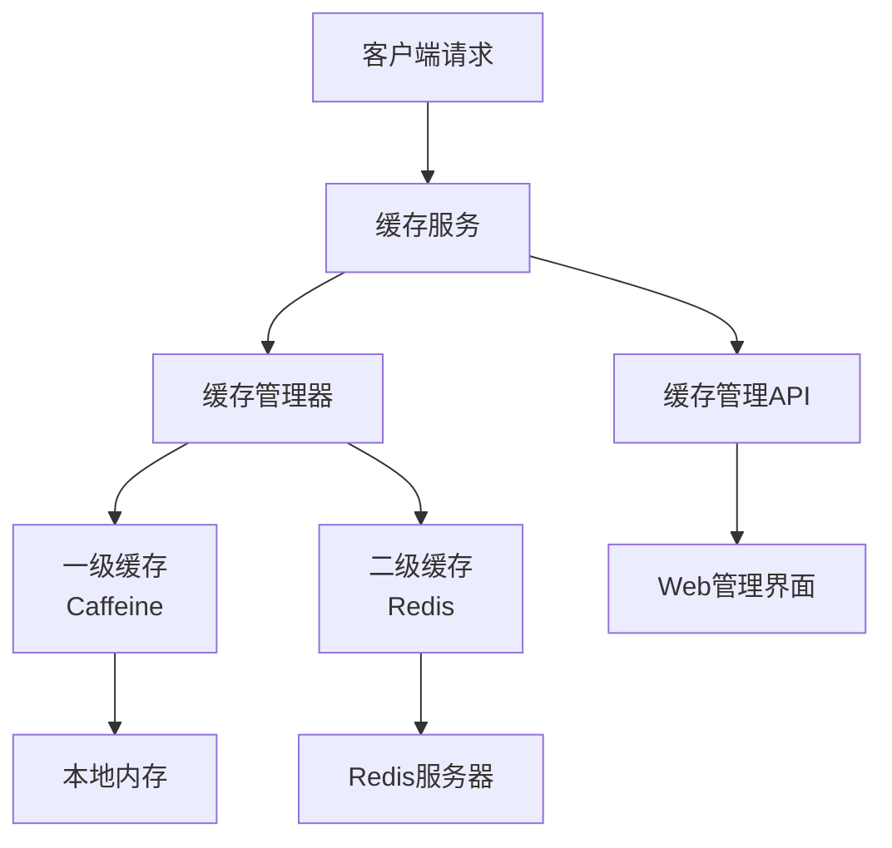
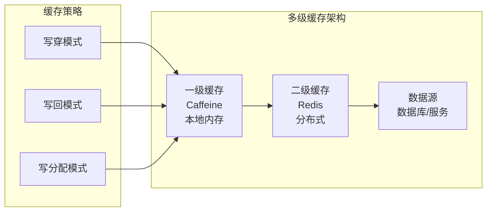

# 缓存模块设计文档

## 概述

本文档描述了API网关缓存模块的详细设计，包括多级缓存架构、缓存策略、性能优化和监控管理等功能。

## 架构设计

### 整体架构



### 多级缓存架构



## 核心组件

### 1. Cache接口

**功能**: 定义缓存的基本操作接口

**核心方法**:
- `get(K key)`: 获取缓存值
- `get(K key, CacheLoader<K, V> loader)`: 获取缓存值，不存在时加载
- `put(K key, V value)`: 设置缓存值
- `put(K key, V value, long expireTime, TimeUnit timeUnit)`: 设置带过期时间的缓存值
- `remove(K key)`: 删除缓存值
- `clear()`: 清空缓存
- `getStats()`: 获取统计信息

### 2. CacheManager接口

**功能**: 缓存管理器，负责缓存的创建、管理和监控

**核心方法**:
- `getCache(String cacheName)`: 获取缓存实例
- `createCache(String cacheName, CacheConfig config)`: 创建缓存
- `removeCache(String cacheName)`: 删除缓存
- `getStats()`: 获取所有缓存统计信息

### 3. CacheConfig配置类

**功能**: 定义缓存的配置参数

**主要配置项**:
- `l1Enabled`: 是否启用一级缓存
- `l2Enabled`: 是否启用二级缓存
- `l1MaxSize`: 一级缓存最大大小
- `l1ExpireAfterWrite`: 一级缓存写入后过期时间
- `l1ExpireAfterAccess`: 一级缓存访问后过期时间
- `l2ExpireAfterWrite`: 二级缓存过期时间
- `updateMode`: 缓存更新模式
- `evictionPolicy`: 缓存驱逐策略

### 4. CacheService服务类

**功能**: 提供高级缓存功能和便捷的操作方法

**核心特性**:
- 类型安全的缓存操作
- 函数式编程支持
- 批量操作支持
- 异常处理机制
- 操作结果封装

## 缓存实现

### 1. CaffeineCache - 一级缓存

**特点**:
- 基于Caffeine的高性能本地缓存
- 支持多种驱逐策略（LRU、LFU、FIFO、RANDOM）
- 支持过期时间和访问时间过期
- 支持最大容量限制
- 支持统计信息收集

**配置示例**:
```java
CacheConfig config = new CacheConfig("user-cache");
config.setL1Enabled(true);
config.setL1MaxSize(1000);
config.setL1ExpireAfterWrite(Duration.ofMinutes(30));
config.setEvictionPolicy(CacheEvictionPolicy.LRU);
```

### 2. RedisCache - 二级缓存

**特点**:
- 基于Redis的分布式缓存
- 支持集群部署
- 支持持久化
- 支持多种数据结构
- 支持事务和Lua脚本

**配置示例**:
```java
CacheConfig.RedisConfig redisConfig = new CacheConfig.RedisConfig();
redisConfig.setHost("localhost");
redisConfig.setPort(6379);
redisConfig.setPassword("password");
redisConfig.setDatabase(0);
redisConfig.setMaxTotal(100);
```

### 3. L2Cache - 二级缓存

**特点**:
- 组合一级和二级缓存
- 支持缓存穿透保护
- 支持缓存雪崩保护
- 支持缓存一致性保证
- 支持异步更新

**工作流程**:
1. 查询一级缓存
2. 一级缓存未命中，查询二级缓存
3. 二级缓存未命中，加载数据
4. 更新二级缓存和一级缓存

## 缓存策略

### 1. 更新模式

#### Write-Through（写穿模式）
- 同时更新一级和二级缓存
- 保证数据一致性
- 性能相对较低

#### Write-Back（写回模式）
- 先更新一级缓存，异步更新二级缓存
- 性能较高
- 可能存在短暂的数据不一致

#### Write-Around（写分配模式）
- 只更新一级缓存，不更新二级缓存
- 适用于频繁更新的数据
- 减少二级缓存压力

### 2. 驱逐策略

#### LRU（最近最少使用）
- 淘汰最近最少使用的数据
- 适用于访问模式相对稳定的场景
- 实现：基于LinkedHashMap的accessOrder=true
- 时间复杂度：O(1)

#### LFU（最近最常使用）
- 淘汰使用频率最低的数据
- 适用于访问频率差异较大的场景
- 实现：基于频率映射和最小堆
- 时间复杂度：O(log n)

#### FIFO（先进先出）
- 淘汰最早进入缓存的数据
- 适用于数据访问无规律的场景
- 实现：基于LinkedList维护插入顺序
- 时间复杂度：O(1)

#### RANDOM（随机驱逐）
- 随机淘汰缓存数据
- 适用于对淘汰策略无特殊要求的场景
- 实现：基于随机数生成器
- 时间复杂度：O(1)

## 性能优化

### 1. 内存优化

```java
// 直接内存分配
bootstrap.childOption(ChannelOption.ALLOCATOR, 
        new PooledByteBufAllocator(true));

// 内存池配置
memoryPoolSize: 1024MB
objectPoolSize: 10000
```

### 2. 连接池优化

```java
// Redis连接池配置
maxTotal: 100
maxIdle: 20
minIdle: 5
maxWait: 3000ms
testOnBorrow: true
testOnReturn: true
```

### 3. 批量操作优化

```java
// 批量获取
Map<K, V> values = cache.getAll(keys);

// 批量设置
cache.putAll(keyValueMap);

// 批量删除
cache.removeAll(keys);
```

## 监控管理

### 1. 统计指标

#### 性能指标
- **命中率**: 缓存命中次数 / 总请求次数
- **未命中率**: 缓存未命中次数 / 总请求次数
- **平均响应时间**: 缓存操作的平均响应时间
- **QPS**: 每秒查询次数

#### 容量指标
- **缓存大小**: 当前缓存中的数据量
- **内存使用率**: 缓存占用的内存比例
- **驱逐次数**: 因容量限制被驱逐的数据量

#### 错误指标
- **异常次数**: 缓存操作异常的次数
- **连接失败次数**: Redis连接失败次数
- **超时次数**: 缓存操作超时次数

### 2. 管理接口

#### REST API接口
```http
# 获取所有缓存名称
GET /api/cache/names

# 获取缓存统计信息
GET /api/cache/stats

# 获取指定缓存统计信息
GET /api/cache/{cacheName}/stats

# 获取缓存值
GET /api/cache/{cacheName}/{key}

# 设置缓存值
POST /api/cache/{cacheName}/{key}

# 删除缓存值
DELETE /api/cache/{cacheName}/{key}

# 清空缓存
DELETE /api/cache/{cacheName}

# 批量操作
POST /api/cache/{cacheName}/batch-get
POST /api/cache/{cacheName}/batch-set
POST /api/cache/{cacheName}/batch-remove
```

### 3. 健康检查

```java
@GetMapping("/health")
public ResponseEntity<Map<String, Object>> healthCheck() {
    Map<String, Object> health = Map.of(
        "status", "UP",
        "cacheCount", cacheService.getCacheNames().size(),
        "timestamp", System.currentTimeMillis()
    );
    return ResponseEntity.ok(health);
}
```

## 配置示例

### application.yml配置

```yaml
# 缓存配置
cache:
  # 是否启用缓存
  enabled: true
  # 缓存名称
  name: default
  # 是否启用一级缓存（本地缓存）
  l1-enabled: true
  # 是否启用二级缓存（Redis缓存）
  l2-enabled: true
  # 一级缓存最大大小
  l1-max-size: 1000
  # 一级缓存过期时间（毫秒）
  l1-expire-after-write: 1800000
  # 一级缓存访问后过期时间（毫秒）
  l1-expire-after-access: 600000
  # 二级缓存过期时间（毫秒）
  l2-expire-after-write: 7200000
  # 是否启用缓存统计
  stats-enabled: true
  # 是否启用缓存预热
  warm-up-enabled: false
  # 缓存键前缀
  key-prefix: ""
  # 是否启用空值缓存
  cache-null-values: false
  # 缓存更新模式
  update-mode: WRITE_THROUGH
  # 缓存驱逐策略
  eviction-policy: LRU
  # Redis配置
  redis:
    # 是否启用Redis
    enabled: true
    # Redis主机地址
    host: localhost
    # Redis端口
    port: 6379
    # Redis密码
    password: 
    # Redis数据库索引
    database: 0
    # 连接超时时间（毫秒）
    connection-timeout: 2000
    # 最大连接数
    max-total: 100
    # 最大空闲连接数
    max-idle: 20
    # 最小空闲连接数
    min-idle: 5
    # 最大等待时间（毫秒）
    max-wait: 3000
```

## 使用示例

### 1. 基本使用

```java
@Service
public class UserService {
    
    @Autowired
    private CacheService cacheService;
    
    public User getUser(String userId) {
        return cacheService.get("user-cache", userId, this::loadUserFromDatabase);
    }
    
    public void updateUser(String userId, User user) {
        cacheService.put("user-cache", userId, user);
    }
    
    private User loadUserFromDatabase(String userId) {
        // 从数据库加载用户数据
        return userRepository.findById(userId);
    }
}
```

### 2. 批量操作

```java
public Map<String, User> getUsers(List<String> userIds) {
    return cacheService.getAll("user-cache", userIds, this::loadUsersFromDatabase);
}

private Map<String, User> loadUsersFromDatabase(Collection<String> userIds) {
    // 从数据库批量加载用户数据
    return userRepository.findByIds(userIds);
}
```

### 3. 自定义配置

```java
@Configuration
public class CacheConfiguration {
    
    @Bean
    public CacheConfig userCacheConfig() {
        CacheConfig config = new CacheConfig("user-cache");
        config.setL1Enabled(true);
        config.setL2Enabled(true);
        config.setL1MaxSize(1000);
        config.setL1ExpireAfterWrite(Duration.ofMinutes(30));
        config.setUpdateMode(CacheUpdateMode.WRITE_THROUGH);
        config.setEvictionPolicy(CacheEvictionPolicy.LRU);
        return config;
    }
    
    @Bean
    public CacheConfig orderCacheConfig() {
        CacheConfig config = new CacheConfig("order-cache");
        config.setL1Enabled(true);
        config.setL2Enabled(false);
        config.setL1MaxSize(500);
        config.setEvictionPolicy(CacheEvictionPolicy.LFU);
        return config;
    }
    
    @Bean
    public CacheConfig tempCacheConfig() {
        CacheConfig config = new CacheConfig("temp-cache");
        config.setL1Enabled(true);
        config.setL2Enabled(false);
        config.setL1MaxSize(100);
        config.setEvictionPolicy(CacheEvictionPolicy.FIFO);
        return config;
    }
}
```

## 最佳实践

### 1. 缓存键设计

```java
// 好的缓存键设计
String cacheKey = String.format("user:%s:profile", userId);
String cacheKey = String.format("order:%s:status", orderId);

// 避免的缓存键设计
String cacheKey = "user"; // 过于简单
String cacheKey = "user_profile_" + userId + "_" + timestamp; // 过于复杂
```

### 2. 缓存粒度

```java
// 细粒度缓存
cacheService.put("user:123:profile", userProfile);
cacheService.put("user:123:orders", userOrders);

// 粗粒度缓存
cacheService.put("user:123", completeUserData);
```

### 3. 缓存更新策略

```java
// 及时更新
public void updateUser(User user) {
    userRepository.save(user);
    cacheService.put("user-cache", user.getId(), user);
}

// 延迟更新
@Async
public void updateUserAsync(User user) {
    userRepository.save(user);
    cacheService.put("user-cache", user.getId(), user);
}
```

### 4. 缓存穿透保护

```java
public User getUser(String userId) {
    return cacheService.get("user-cache", userId, key -> {
        User user = userRepository.findById(key);
        if (user == null) {
            // 缓存空值，防止缓存穿透
            cacheService.put("user-cache", key, null, 5, TimeUnit.MINUTES);
        }
        return user;
    });
}
```

## 故障处理

### 1. 缓存雪崩

**问题**: 大量缓存同时过期，导致请求直接打到数据库

**解决方案**:
- 设置随机过期时间
- 使用缓存预热
- 实现熔断机制

```java
// 随机过期时间
long expireTime = baseExpireTime + random.nextInt(300000); // 增加随机5分钟
cacheService.put(cacheName, key, value, expireTime, TimeUnit.MILLISECONDS);
```

### 2. 缓存穿透

**问题**: 查询不存在的数据，导致请求直接打到数据库

**解决方案**:
- 缓存空值
- 布隆过滤器
- 参数校验

```java
// 缓存空值
if (value == null) {
    cacheService.put(cacheName, key, null, 5, TimeUnit.MINUTES);
}
```

### 3. 缓存击穿

**问题**: 热点数据过期，大量请求同时打到数据库

**解决方案**:
- 互斥锁
- 永不过期
- 异步更新

```java
// 互斥锁
synchronized (this) {
    value = cacheService.get(cacheName, key);
    if (value == null) {
        value = loadFromDatabase(key);
        cacheService.put(cacheName, key, value);
    }
}
```

## 驱逐策略实现

### 核心组件

1. **EvictionPolicy接口**: 定义驱逐策略的基本操作
2. **EvictionStats类**: 驱逐统计信息
3. **LRUEvictionPolicy**: LRU策略实现
4. **LFUEvictionPolicy**: LFU策略实现
5. **FIFOEvictionPolicy**: FIFO策略实现
6. **RandomEvictionPolicy**: RANDOM策略实现
7. **EvictionPolicyFactory**: 驱逐策略工厂
8. **EvictionBasedCache**: 基于驱逐策略的缓存实现

### 实现特点

1. **线程安全**: 使用ReadWriteLock保证并发安全
2. **高性能**: 优化的数据结构和算法
3. **可监控**: 完整的统计信息收集
4. **易扩展**: 支持自定义驱逐策略
5. **内存友好**: 合理的内存使用和垃圾回收

### 使用示例

```java
// 创建不同策略的缓存
CacheConfig lruConfig = new CacheConfig("lru-cache");
lruConfig.setEvictionPolicy(CacheEvictionPolicy.LRU);
lruConfig.setL1MaxSize(1000);

CacheConfig lfuConfig = new CacheConfig("lfu-cache");
lfuConfig.setEvictionPolicy(CacheEvictionPolicy.LFU);
lfuConfig.setL1MaxSize(500);

// 使用缓存
Cache<String, User> lruCache = cacheService.createCache("lru-cache", lruConfig);
Cache<String, Order> lfuCache = cacheService.createCache("lfu-cache", lfuConfig);
```

## 总结

缓存模块提供了完整的多级缓存解决方案，具有以下特点：

1. **高性能**: 基于Caffeine和Redis的高性能缓存
2. **高可用**: 支持集群部署和故障转移
3. **易用性**: 提供简洁的API和自动配置
4. **可监控**: 完整的统计信息和监控接口
5. **可扩展**: 支持自定义缓存策略和实现
6. **多样化驱逐策略**: 支持LRU、LFU、FIFO、RANDOM四种驱逐策略

该模块能够有效提升API网关的性能，减少后端服务压力，提供更好的用户体验。 