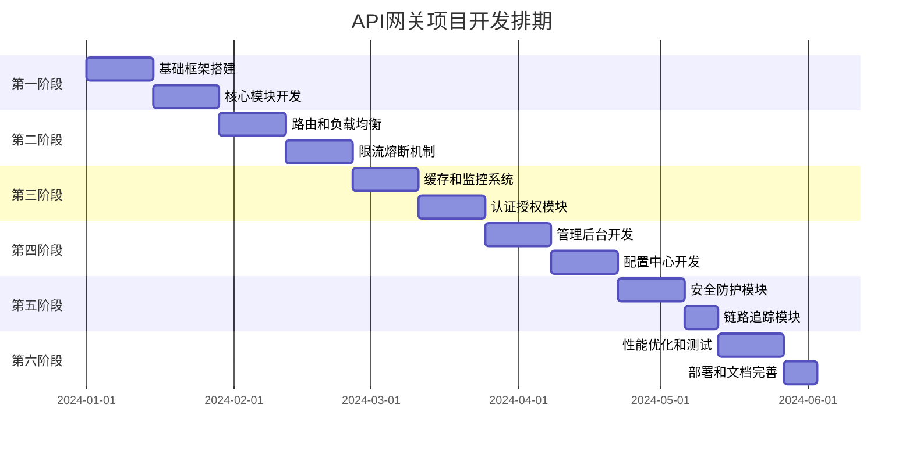

# API网关项目开发分阶段排期计划

## 项目概述

**项目名称**: 高性能API网关系统  
**开发周期**: 总计16周（4个月）  
**团队规模**: 6-8人（后端开发4人，前端开发2人，测试2人）  
**技术栈**: Netty + Spring Boot + Java JUC + Vue.js

## 开发阶段总览

## 第一阶段：基础框架搭建（第1-4周）

### 目标
建立项目基础架构，搭建核心开发环境

### 详细任务

#### 第1-2周：项目初始化
**负责人**: 架构师 + 后端开发工程师

**任务清单**:
- [ ] 项目结构搭建
  - 创建Maven多模块项目
  - 配置基础依赖和插件
  - 设置代码规范和检查工具
- [ ] 基础配置
  - 配置Spring Boot基础环境
  - 配置Netty服务器框架
  - 配置数据库连接（MySQL）
  - 配置Redis连接
- [ ] 开发环境搭建
  - 配置开发、测试、生产环境
  - 设置日志系统（Logback）
  - 配置单元测试框架
  - 搭建CI/CD基础环境

**交付物**:
- 项目基础框架代码
- 开发环境配置文档
- 基础配置文件

#### 第3-4周：核心模块开发
**负责人**: 后端开发工程师

**任务清单**:
- [ ] Netty服务器开发
  - 实现HTTP服务器
  - 配置线程池和连接池
  - 实现请求解码和响应编码
- [ ] 基础过滤器框架
  - 设计过滤器链架构
  - 实现基础过滤器接口
  - 开发日志过滤器
- [ ] 基础路由框架
  - 设计路由匹配接口
  - 实现简单路由匹配
  - 开发路由配置管理

**交付物**:
- Netty服务器核心代码
- 过滤器框架代码
- 基础路由框架代码

**里程碑**: 完成基础框架，可以进行简单的HTTP请求转发

---

## 第二阶段：核心功能开发（第5-8周）

### 目标
实现路由管理和负载均衡核心功能

### 详细任务

#### 第5-6周：路由和负载均衡
**负责人**: 后端开发工程师

**任务清单**:
- [ ] 路由管理模块
  - 实现精确匹配、前缀匹配、正则匹配
  - 开发路由配置CRUD接口
  - 实现路由缓存机制
  - 开发路由热更新功能
- [ ] 负载均衡模块
  - 实现轮询算法
  - 实现权重轮询算法
  - 实现最小连接数算法
  - 开发健康检查机制
- [ ] 服务发现集成
  - 集成服务注册中心
  - 实现服务实例管理
  - 开发服务健康检查

**交付物**:
- 完整的路由管理模块
- 负载均衡算法实现
- 服务发现集成代码

#### 第7-8周：限流熔断机制
**负责人**: 后端开发工程师

**任务清单**:
- [ ] 限流模块
  - 实现令牌桶算法
  - 实现滑动窗口算法
  - 开发限流配置管理
  - 实现多维度限流（IP、用户、接口）
- [ ] 熔断器模块
  - 实现熔断器状态机
  - 开发失败计数和成功计数
  - 实现超时和重试机制
  - 开发熔断器配置管理
- [ ] 降级策略
  - 实现服务降级机制
  - 开发降级响应配置
  - 实现优雅降级

**交付物**:
- 完整的限流模块
- 熔断器实现
- 降级策略代码

**里程碑**: 完成核心功能，支持基本的API网关功能

---

## 第三阶段：缓存和监控（第9-12周）

### 目标
实现缓存系统和监控体系

### 详细任务

#### 第9-10周：缓存和监控系统
**负责人**: 后端开发工程师

**任务清单**:
- [ ] 缓存模块
  - 实现多级缓存架构
  - 开发本地缓存（Caffeine）
  - 集成Redis分布式缓存
  - 实现缓存更新策略
- [ ] 监控系统
  - 实现指标收集器
  - 开发性能指标统计
  - 集成Prometheus监控
  - 实现监控数据上报
- [ ] 告警系统
  - 开发告警规则引擎
  - 实现告警通知机制
  - 集成邮件和短信通知

**交付物**:
- 完整的缓存系统
- 监控指标收集系统
- 告警通知系统

#### 第11-12周：认证授权模块
**负责人**: 后端开发工程师

**任务清单**:
- [ ] 认证模块
  - 实现JWT Token验证
  - 开发OAuth2集成
  - 实现API Key认证
  - 开发用户会话管理
- [ ] 授权模块
  - 实现权限控制
  - 开发角色管理
  - 实现访问控制列表
  - 开发权限缓存
- [ ] 安全防护
  - 实现IP白名单
  - 开发DDoS防护
  - 实现请求签名验证

**交付物**:
- 完整的认证授权系统
- 安全防护机制
- 权限管理功能

**里程碑**: 完成缓存和监控，系统具备完整的运维能力

---

## 第四阶段：管理后台开发（第13-16周）

### 目标
开发可视化管理界面和配置中心

### 详细任务

#### 第13-14周：管理后台开发
**负责人**: 前端开发工程师 + 后端开发工程师

**任务清单**:
- [ ] 前端框架搭建
  - 搭建Vue.js项目
  - 配置Element Plus UI库
  - 实现路由和状态管理
  - 开发基础组件库
- [ ] 管理界面开发
  - 开发仪表板页面
  - 实现路由配置界面
  - 开发限流配置界面
  - 实现监控数据展示
- [ ] 后端API开发
  - 开发管理后台API
  - 实现配置管理接口
  - 开发监控数据接口
  - 实现用户管理接口

**交付物**:
- 完整的管理后台前端
- 管理后台后端API
- 用户操作手册

#### 第15-16周：配置中心开发
**负责人**: 后端开发工程师

**任务清单**:
- [ ] 配置中心
  - 实现配置存储管理
  - 开发配置版本控制
  - 实现配置热更新
  - 开发配置同步机制
- [ ] 注册中心
  - 实现服务注册
  - 开发服务发现
  - 实现服务健康检查
  - 开发集群管理
- [ ] 配置管理
  - 实现配置模板
  - 开发配置验证
  - 实现配置回滚
  - 开发配置审计

**交付物**:
- 完整的配置中心
- 服务注册中心
- 配置管理功能

**里程碑**: 完成管理后台，具备完整的运维管理能力

---

## 第五阶段：高级功能开发（第17-20周）

### 目标
实现安全防护和链路追踪等高级功能

### 详细任务

#### 第17-18周：安全防护模块
**负责人**: 安全工程师 + 后端开发工程师

**任务清单**:
- [ ] 安全防护
  - 实现WAF防护
  - 开发SQL注入检测
  - 实现XSS防护
  - 开发CSRF防护
- [ ] 安全监控
  - 实现安全事件监控
  - 开发威胁检测
  - 实现安全日志
  - 开发安全告警
- [ ] 安全配置
  - 实现安全策略配置
  - 开发黑白名单管理
  - 实现安全规则引擎

**交付物**:
- 完整的安全防护系统
- 安全监控功能
- 安全配置管理

#### 第19-20周：链路追踪模块
**负责人**: 后端开发工程师

**任务清单**:
- [ ] 链路追踪
  - 实现TraceId生成
  - 开发Span管理
  - 实现链路数据收集
  - 开发链路分析
- [ ] 性能分析
  - 实现性能瓶颈分析
  - 开发调用链分析
  - 实现性能优化建议
- [ ] 可视化展示
  - 开发链路追踪界面
  - 实现性能分析图表
  - 开发问题定位功能

**交付物**:
- 完整的链路追踪系统
- 性能分析功能
- 可视化展示界面

**里程碑**: 完成高级功能，系统具备企业级特性

---

## 第六阶段：性能优化和测试（第21-24周）

### 目标
性能优化、全面测试和部署上线

### 详细任务

#### 第21-22周：性能优化和测试
**负责人**: 性能工程师 + 测试工程师

**任务清单**:
- [ ] 性能优化
  - JVM参数调优
  - 线程池优化
  - 内存池优化
  - 网络参数优化
- [ ] 压力测试
  - 单机性能测试
  - 集群性能测试
  - 稳定性测试
  - 极限压力测试
- [ ] 功能测试
  - 单元测试完善
  - 集成测试
  - 端到端测试
  - 安全测试

**交付物**:
- 性能优化报告
- 测试报告
- 性能基准数据

#### 第23-24周：部署和文档完善
**负责人**: 运维工程师 + 技术文档工程师

**任务清单**:
- [ ] 部署准备
  - 制作Docker镜像
  - 编写部署脚本
  - 配置Kubernetes部署
  - 准备生产环境
- [ ] 文档完善
  - 完善技术文档
  - 编写用户手册
  - 制作运维手册
  - 编写故障处理指南
- [ ] 上线准备
  - 生产环境部署
  - 监控告警配置
  - 备份恢复测试
  - 应急预案制定

**交付物**:
- 生产环境部署包
- 完整的项目文档
- 运维手册和应急预案

**里程碑**: 项目正式上线，具备生产环境运行能力

---

## 人员配置和职责分工

### 核心团队配置

| 角色 | 人数 | 主要职责 | 参与阶段 |
|------|------|----------|----------|
| 项目经理 | 1 | 项目管理和协调 | 全程 |
| 架构师 | 1 | 技术架构设计 | 第1-4周 |
| 后端开发工程师 | 4 | 核心功能开发 | 第1-20周 |
| 前端开发工程师 | 2 | 管理后台开发 | 第13-16周 |
| 测试工程师 | 2 | 功能测试和性能测试 | 第21-22周 |
| 运维工程师 | 1 | 部署和运维 | 第23-24周 |
| 安全工程师 | 1 | 安全功能开发 | 第17-18周 |

### 技能要求

**后端开发工程师**:
- 精通Java、Spring Boot、Netty
- 熟悉高并发编程和性能优化
- 了解分布式系统设计
- 熟悉Redis、MySQL等数据库

**前端开发工程师**:
- 精通Vue.js、JavaScript
- 熟悉Element Plus等UI框架
- 了解前端工程化和构建工具
- 熟悉HTTP协议和RESTful API

**测试工程师**:
- 熟悉性能测试工具（JMeter、wrk等）
- 了解自动化测试框架
- 熟悉测试用例设计
- 了解性能分析和调优

---

## 风险评估和应对策略

### 主要风险

| 风险类型 | 风险描述 | 影响程度 | 应对策略 |
|----------|----------|----------|----------|
| 技术风险 | Netty性能调优复杂 | 高 | 提前进行技术预研和POC |
| 进度风险 | 功能模块开发延期 | 中 | 设置缓冲时间，并行开发 |
| 人员风险 | 关键人员离职 | 高 | 知识共享，文档完善 |
| 性能风险 | 无法达到百万QPS目标 | 高 | 早期性能测试，持续优化 |

### 应对措施

1. **技术预研**: 在项目开始前进行关键技术验证
2. **并行开发**: 合理安排任务，提高开发效率
3. **知识管理**: 建立完善的知识共享机制
4. **持续测试**: 从早期开始进行性能测试

---

## 质量保证措施

### 代码质量
- 代码审查制度
- 自动化代码检查
- 单元测试覆盖率要求（>80%）
- 集成测试覆盖

### 性能质量
- 性能基准测试
- 压力测试验证
- 性能监控告警
- 性能优化迭代

### 文档质量
- 技术文档审查
- 用户手册测试
- 运维手册验证
- 文档版本管理

---

## 项目交付物清单

### 代码交付物
- [ ] 完整的源代码
- [ ] 单元测试代码
- [ ] 集成测试代码
- [ ] 部署脚本和配置

### 文档交付物
- [ ] 技术设计文档
- [ ] API接口文档
- [ ] 用户操作手册
- [ ] 运维部署手册
- [ ] 故障处理指南

### 测试交付物
- [ ] 测试计划和用例
- [ ] 测试报告
- [ ] 性能测试报告
- [ ] 安全测试报告

### 部署交付物
- [ ] Docker镜像
- [ ] Kubernetes配置文件
- [ ] 部署脚本
- [ ] 监控配置

---

## 总结

本开发计划将API网关项目分为6个阶段，总计24周完成。每个阶段都有明确的目标、任务和交付物，确保项目能够按计划推进。

**关键成功因素**:
1. 合理的阶段划分和任务安排
2. 充分的并行开发
3. 持续的质量保证
4. 有效的风险控制

**预期成果**:
- 一个功能完整的高性能API网关系统
- 支持百万级QPS的处理能力
- 具备企业级的可用性和可扩展性
- 完整的运维管理能力

通过这个分阶段的开发计划，可以确保项目在可控的时间内完成，同时保证系统的质量和性能。 