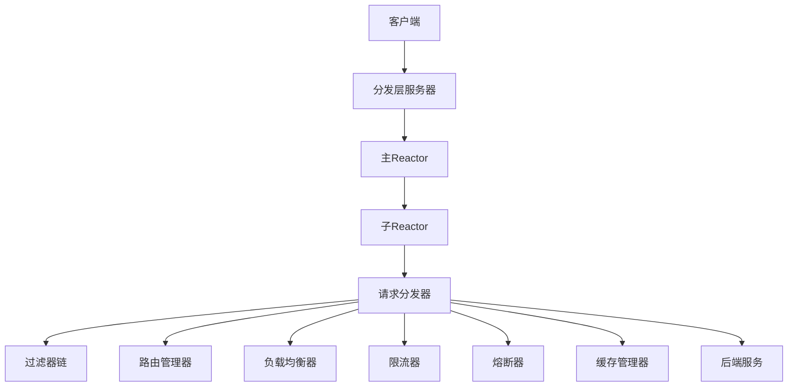
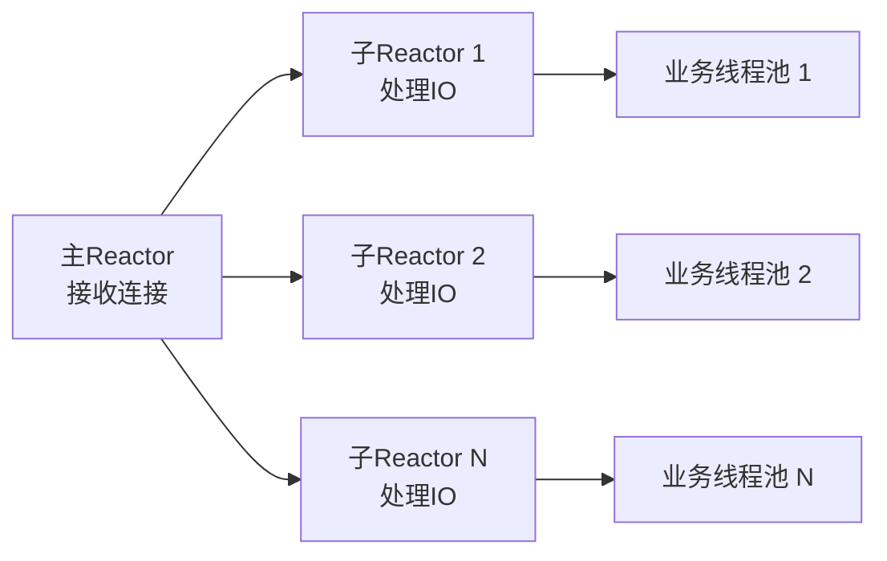

# 分发层设计文档

## 概述

本文档描述了基于Netty NIO+Reactor模型的高性能API网关分发层设计。分发层是API网关的核心组件，负责接收、分发和处理HTTP请求，实现百万级QPS的高性能目标。

## 架构设计

### 整体架构



### Reactor模型设计



## 核心组件

### 1. DispatcherConfig - 分发层配置

**功能**: 定义分发层的所有配置参数

**主要配置项**:
- `mainReactorThreads`: 主Reactor线程数（接收连接）
- `subReactorThreads`: 子Reactor线程数（处理IO）
- `businessThreadPoolSize`: 业务处理线程池大小
- `maxContentLength`: 最大请求体大小
- `connectionPoolEnabled`: 是否启用连接池
- `rateLimitEnabled`: 是否启用限流
- `circuitBreakerEnabled`: 是否启用熔断器

### 2. RequestContext - 请求上下文

**功能**: 在分发层中传递请求相关的上下文信息

**核心属性**:
- `requestId`: 请求唯一标识
- `request`: 原始HTTP请求
- `response`: HTTP响应
- `clientChannel`: 客户端连接通道
- `startTime/endTime`: 请求处理时间戳
- `status`: 请求处理状态
- `routeInfo`: 路由信息
- `loadBalanceInfo`: 负载均衡信息
- `rateLimitInfo`: 限流信息
- `circuitBreakerInfo`: 熔断器信息

### 3. RequestDispatcher - 请求分发器接口

**功能**: 定义分发层的核心分发逻辑

**核心方法**:
- `dispatch()`: 分发请求
- `process()`: 处理请求
- `route()`: 路由请求
- `forward()`: 转发请求
- `handleResponse()`: 处理响应
- `handleException()`: 处理异常

### 4. DefaultRequestDispatcher - 默认请求分发器实现

**功能**: 实现基于Netty NIO+Reactor模型的高性能请求分发器

**处理流程**:
1. **限流检查**: 检查请求是否超过QPS限制
2. **熔断器检查**: 检查服务是否处于熔断状态
3. **过滤器链执行**: 执行预定义的过滤器链
4. **路由查找**: 根据请求路径查找匹配的路由
5. **负载均衡**: 选择合适的后端服务实例
6. **请求转发**: 将请求转发到后端服务
7. **响应处理**: 处理后端服务响应并返回给客户端

### 5. NettyDispatcherServer - 分发层服务器

**功能**: 基于Netty NIO+Reactor模型的分发层服务器

**核心特性**:
- **主Reactor**: 负责接收客户端连接
- **子Reactor**: 负责处理IO事件
- **业务线程池**: 负责处理业务逻辑
- **连接池**: 管理后端服务连接
- **零拷贝**: 支持零拷贝传输
- **直接内存**: 使用直接内存提高性能

## 性能优化

### 1. 线程模型优化

```java
// 主Reactor线程组（接收连接的线程）
mainReactorGroup = new NioEventLoopGroup(dispatcherConfig.getMainReactorThreads());

// 子Reactor线程组（处理IO的线程）
subReactorGroup = new NioEventLoopGroup(dispatcherConfig.getSubReactorThreads());

// 业务处理线程池
businessExecutor = Executors.newFixedThreadPool(dispatcherConfig.getBusinessThreadPoolSize());
```

### 2. 内存优化

```java
// 启用直接内存
if (dispatcherConfig.isDirectBuffer()) {
    bootstrap.childOption(ChannelOption.ALLOCATOR, 
            new PooledByteBufAllocator(true));
}

// 启用零拷贝
if (dispatcherConfig.isZeroCopy()) {
    // 使用FileRegion进行零拷贝传输
}
```

### 3. 连接优化

```java
// TCP优化选项
.option(ChannelOption.SO_BACKLOG, dispatcherConfig.getBacklog())
.option(ChannelOption.SO_REUSEADDR, dispatcherConfig.isReuseAddr())
.childOption(ChannelOption.SO_KEEPALIVE, dispatcherConfig.isKeepAlive())
.childOption(ChannelOption.TCP_NODELAY, dispatcherConfig.isTcpNoDelay())
```

### 4. 异步处理

```java
// 异步分发请求
requestDispatcher.dispatch(context)
    .thenCompose(this::process)
    .thenCompose(this::route)
    .thenCompose(this::forward)
    .thenCompose(this::handleResponse)
    .exceptionally(throwable -> handleException(context, throwable).join());
```

## 配置示例

### application.yml配置

```yaml
gateway:
  dispatcher:
    enabled: true
    # 主Reactor线程数（接收连接的线程）
    main-reactor-threads: 1
    # 子Reactor线程数（处理IO的线程）
    sub-reactor-threads: 16
    # 业务处理线程池大小
    business-thread-pool-size: 32
    # 连接队列大小
    backlog: 1024
    # 连接超时时间（毫秒）
    connection-timeout: 30000
    # 读取超时时间（毫秒）
    read-timeout: 60000
    # 写入超时时间（毫秒）
    write-timeout: 60000
    # 最大请求体大小（字节）
    max-content-length: 1048576
    # 是否启用TCP_NODELAY
    tcp-no-delay: true
    # 是否启用SO_KEEPALIVE
    keep-alive: true
    # 是否启用SO_REUSEADDR
    reuse-addr: true
    # 是否启用零拷贝
    zero-copy: true
    # 是否启用直接内存
    direct-buffer: true
    # 缓冲区大小（字节）
    buffer-size: 8192
    # 是否启用连接池
    connection-pool-enabled: true
    # 连接池最大连接数
    max-connections: 10000
    # 连接池空闲连接数
    idle-connections: 1000
    # 连接池连接超时时间（毫秒）
    pool-connection-timeout: 5000
    # 是否启用请求限流
    rate-limit-enabled: true
    # 默认QPS限制
    default-qps: 10000
    # 是否启用熔断器
    circuit-breaker-enabled: true
    # 是否启用监控统计
    metrics-enabled: true
```

## 使用示例

### 启动分发层服务器

```java
@SpringBootApplication
public class GatewayApplication {
    
    @Autowired
    private NettyDispatcherServer dispatcherServer;
    
    public static void main(String[] args) {
        SpringApplication.run(GatewayApplication.class, args);
    }
    
    @PostConstruct
    public void startDispatcher() throws Exception {
        dispatcherServer.start();
    }
}
```

### 自定义请求分发器

```java
@Component
public class CustomRequestDispatcher implements RequestDispatcher {
    
    @Override
    public CompletableFuture<RequestContext> dispatch(RequestContext context) {
        // 自定义分发逻辑
        return CompletableFuture.supplyAsync(() -> {
            // 处理请求
            return context;
        });
    }
    
    // 实现其他方法...
}
```

## 监控指标

### 性能指标

- **QPS**: 每秒请求数
- **响应时间**: 平均、P95、P99响应时间
- **错误率**: 请求失败率
- **连接数**: 活跃连接数
- **线程池使用率**: 业务线程池使用情况

### 业务指标

- **路由命中率**: 路由匹配成功率
- **负载均衡分布**: 各后端实例的请求分布
- **限流统计**: 限流触发次数
- **熔断统计**: 熔断器状态变化

## 扩展性设计

### 1. 插件化架构

分发层采用插件化设计，支持以下扩展点：
- 自定义请求分发器
- 自定义过滤器
- 自定义负载均衡策略
- 自定义限流算法
- 自定义熔断器策略

### 2. 配置热更新

支持配置的热更新，无需重启服务即可调整：
- 线程池大小
- 限流阈值
- 熔断器参数
- 路由规则

### 3. 集群部署

支持集群部署，通过以下方式实现：
- 服务注册与发现
- 配置中心
- 监控中心
- 负载均衡

## 故障处理

### 1. 异常处理

- **网络异常**: 自动重试机制
- **服务异常**: 熔断器保护
- **超时异常**: 超时控制
- **限流异常**: 优雅降级

### 2. 降级策略

- **服务降级**: 返回默认响应
- **功能降级**: 关闭非核心功能
- **性能降级**: 降低处理能力

### 3. 恢复机制

- **自动恢复**: 熔断器自动恢复
- **手动恢复**: 管理界面手动恢复
- **监控告警**: 异常情况及时告警

## 总结

基于Netty NIO+Reactor模型的分发层设计具有以下优势：

1. **高性能**: 异步非阻塞IO，支持百万级QPS
2. **高可用**: 完善的熔断、降级、限流机制
3. **可扩展**: 插件化架构，支持功能扩展
4. **易维护**: 清晰的模块划分和配置管理
5. **可监控**: 丰富的监控指标和告警机制

该设计为API网关提供了强大的分发能力，能够满足高并发、低延迟的业务需求。 