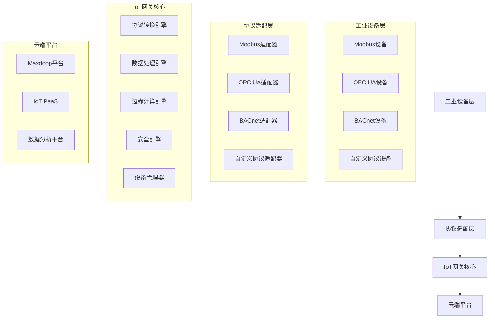

# 工业IoT网关重构设计方案

## 一、设计概述

基于现有的高性能API网关架构，结合工业IoT业务需求，设计一个支持多协议转换、边缘计算、实时数据处理的工业IoT网关系统。该方案将现有网关的HTTP/REST能力扩展到工业协议领域，同时保持高性能、高可用的特性。

## 二、系统架构设计

### 2.1 整体架构



### 2.2 分层架构设计

#### 第一层：设备接入层 (Device Access Layer)
- **物理接口支持**：RS485、RS232、以太网、WiFi、4G/5G
- **协议适配器**：Modbus RTU/TCP、OPC UA、BACnet、自定义协议
- **设备发现**：自动设备发现和注册
- **连接管理**：设备连接池和故障转移

#### 第二层：协议转换层 (Protocol Conversion Layer)
- **中间格式**：基于JSON的统一数据格式
- **协议映射**：设备协议到JSON的映射规则
- **数据转换**：单位转换、数据类型转换
- **实时转换**：毫秒级协议转换响应

#### 第三层：数据处理层 (Data Processing Layer)
- **数据清洗**：异常值检测和过滤
- **数据聚合**：时序数据聚合和计算
- **边缘计算**：本地规则引擎和计算
- **缓存管理**：多级缓存策略

#### 第四层：安全通信层 (Security Communication Layer)
- **加密传输**：TLS/DTLS加密
- **身份认证**：X.509证书、JWT Token
- **访问控制**：RBAC权限模型
- **安全审计**：操作日志和审计

#### 第五层：平台对接层 (Platform Integration Layer)
- **标准协议**：MQTT、HTTP、CoAP
- **平台适配**：Maxdoop、阿里云IoT、AWS IoT
- **数据同步**：实时同步和离线缓存
- **配置管理**：远程配置和固件升级

## 三、核心模块设计

### 3.1 协议适配器模块 (Protocol Adapter Module)

```java
/**
 * 协议适配器接口
 */
public interface ProtocolAdapter {
    /**
     * 连接设备
     */
    boolean connect(DeviceConfig config);
    
    /**
     * 读取数据
     */
    DeviceData readData(ReadRequest request);
    
    /**
     * 写入数据
     */
    boolean writeData(WriteRequest request);
    
    /**
     * 获取设备状态
     */
    DeviceStatus getStatus();
    
    /**
     * 断开连接
     */
    void disconnect();
}

/**
 * Modbus协议适配器
 */
@Component
public class ModbusAdapter implements ProtocolAdapter {
    private final ModbusMaster master;
    private final ModbusConfig config;
    
    @Override
    public DeviceData readData(ReadRequest request) {
        // 实现Modbus数据读取
        // 支持线圈、离散输入、输入寄存器、保持寄存器
    }
    
    @Override
    public boolean writeData(WriteRequest request) {
        // 实现Modbus数据写入
        // 支持线圈、保持寄存器写入
    }
}
```

### 3.2 协议转换引擎 (Protocol Conversion Engine)

```java
/**
 * 协议转换引擎
 */
@Component
public class ProtocolConversionEngine {
    
    /**
     * 设备协议到JSON转换
     */
    public JsonData convertToJson(DeviceData deviceData, ProtocolMapping mapping) {
        JsonData jsonData = new JsonData();
        
        // 根据映射规则转换数据
        for (DataPoint point : deviceData.getDataPoints()) {
            String jsonField = mapping.getJsonField(point.getAddress());
            Object value = convertValue(point.getValue(), mapping.getConversionRule(point.getAddress()));
            jsonData.setField(jsonField, value);
        }
        
        return jsonData;
    }
    
    /**
     * JSON到设备协议转换
     */
    public DeviceData convertToDevice(JsonData jsonData, ProtocolMapping mapping) {
        DeviceData deviceData = new DeviceData();
        
        // 根据映射规则转换JSON数据
        for (String jsonField : jsonData.getFields()) {
            DataPoint point = mapping.getDataPoint(jsonField);
            Object value = convertValue(jsonData.getField(jsonField), mapping.getConversionRule(jsonField));
            deviceData.addDataPoint(point.getAddress(), value);
        }
        
        return deviceData;
    }
}
```

### 3.3 边缘计算引擎 (Edge Computing Engine)

```java
/**
 * 边缘计算引擎
 */
@Component
public class EdgeComputingEngine {
    
    /**
     * 规则引擎
     */
    private final RuleEngine ruleEngine;
    
    /**
     * 本地计算
     */
    public ComputationResult compute(DeviceData data, ComputationRule rule) {
        // 执行边缘计算规则
        return ruleEngine.execute(data, rule);
    }
    
    /**
     * 数据聚合
     */
    public AggregatedData aggregate(List<DeviceData> dataList, AggregationRule rule) {
        // 执行数据聚合
        return new AggregatedData();
    }
    
    /**
     * 异常检测
     */
    public List<Anomaly> detectAnomalies(DeviceData data, AnomalyRule rule) {
        // 执行异常检测
        return new ArrayList<>();
    }
}
```

### 3.4 设备管理器 (Device Manager)

```java
/**
 * 设备管理器
 */
@Component
public class DeviceManager {
    
    /**
     * 设备注册表
     */
    private final Map<String, DeviceInfo> deviceRegistry = new ConcurrentHashMap<>();
    
    /**
     * 设备连接池
     */
    private final Map<String, ProtocolAdapter> connectionPool = new ConcurrentHashMap<>();
    
    /**
     * 注册设备
     */
    public void registerDevice(DeviceInfo deviceInfo) {
        deviceRegistry.put(deviceInfo.getDeviceId(), deviceInfo);
        
        // 创建协议适配器
        ProtocolAdapter adapter = createAdapter(deviceInfo.getProtocolType());
        connectionPool.put(deviceInfo.getDeviceId(), adapter);
    }
    
    /**
     * 获取设备数据
     */
    public DeviceData getDeviceData(String deviceId, ReadRequest request) {
        ProtocolAdapter adapter = connectionPool.get(deviceId);
        if (adapter != null) {
            return adapter.readData(request);
        }
        throw new DeviceNotFoundException("Device not found: " + deviceId);
    }
    
    /**
     * 写入设备数据
     */
    public boolean writeDeviceData(String deviceId, WriteRequest request) {
        ProtocolAdapter adapter = connectionPool.get(deviceId);
        if (adapter != null) {
            return adapter.writeData(request);
        }
        throw new DeviceNotFoundException("Device not found: " + deviceId);
    }
}
```

## 四、数据模型设计

### 4.1 设备数据模型

```java
/**
 * 设备数据模型
 */
public class DeviceData {
    private String deviceId;
    private long timestamp;
    private List<DataPoint> dataPoints;
    private DeviceStatus status;
    
    public static class DataPoint {
        private String address;      // 设备地址
        private Object value;        // 数据值
        private DataType dataType;   // 数据类型
        private String unit;         // 单位
        private Quality quality;     // 数据质量
    }
}

/**
 * JSON数据模型
 */
public class JsonData {
    private String deviceId;
    private long timestamp;
    private Map<String, Object> fields;
    private Map<String, Object> metadata;
}
```

### 4.2 协议映射模型

```java
/**
 * 协议映射配置
 */
public class ProtocolMapping {
    private String deviceId;
    private String protocolType;
    private Map<String, String> addressMapping;      // 地址映射
    private Map<String, ConversionRule> conversionRules;  // 转换规则
    private Map<String, ValidationRule> validationRules;  // 验证规则
    
    public static class ConversionRule {
        private String formula;      // 转换公式
        private String sourceUnit;   // 源单位
        private String targetUnit;   // 目标单位
        private double scale;        // 缩放因子
        private double offset;       // 偏移量
    }
}
```

## 五、配置管理设计

### 5.1 设备配置

```yaml
# 设备配置示例
devices:
  - deviceId: "temp_sensor_001"
    name: "温度传感器001"
    protocolType: "MODBUS_RTU"
    connection:
      type: "RS485"
      port: "/dev/ttyUSB0"
      baudRate: 9600
      dataBits: 8
      stopBits: 1
      parity: "NONE"
    mapping:
      temperature:
        address: "30001"
        dataType: "FLOAT32"
        unit: "°C"
        conversion:
          formula: "value / 10"
          scale: 0.1
      humidity:
        address: "30002"
        dataType: "FLOAT32"
        unit: "%RH"
        conversion:
          formula: "value / 10"
          scale: 0.1
    rules:
      - name: "温度告警"
        condition: "temperature > 50"
        action: "send_alert"
        level: "WARNING"
```

### 5.2 协议配置

```yaml
# Modbus协议配置
protocols:
  modbus:
    timeout: 3000
    retries: 3
    interFrameDelay: 10
    maxConnections: 10
    connectionPool:
      maxIdle: 5
      maxActive: 20
      minIdle: 2
      maxWait: 5000
```

## 六、安全机制设计

### 6.1 通信安全

```java
/**
 * 安全通信管理器
 */
@Component
public class SecurityManager {
    
    /**
     * TLS配置
     */
    private final TlsConfig tlsConfig;
    
    /**
     * 证书管理器
     */
    private final CertificateManager certificateManager;
    
    /**
     * 加密传输
     */
    public byte[] encrypt(byte[] data, String deviceId) {
        // 使用设备证书加密数据
        return encryptionService.encrypt(data, getDeviceCertificate(deviceId));
    }
    
    /**
     * 解密数据
     */
    public byte[] decrypt(byte[] encryptedData, String deviceId) {
        // 解密设备数据
        return encryptionService.decrypt(encryptedData, getDeviceCertificate(deviceId));
    }
}
```

### 6.2 访问控制

```java
/**
 * 访问控制管理器
 */
@Component
public class AccessControlManager {
    
    /**
     * 权限验证
     */
    public boolean hasPermission(String deviceId, String operation, String userId) {
        // 基于RBAC的权限验证
        return permissionService.checkPermission(deviceId, operation, userId);
    }
    
    /**
     * 操作审计
     */
    public void auditOperation(String deviceId, String operation, String userId, Object result) {
        // 记录操作审计日志
        auditService.logOperation(deviceId, operation, userId, result);
    }
}
```

## 七、性能优化设计

### 7.1 连接池优化

```java
/**
 * 连接池管理器
 */
@Component
public class ConnectionPoolManager {
    
    /**
     * 协议连接池
     */
    private final Map<String, GenericObjectPool<ProtocolAdapter>> pools = new ConcurrentHashMap<>();
    
    /**
     * 获取连接
     */
    public ProtocolAdapter getConnection(String deviceId) throws Exception {
        GenericObjectPool<ProtocolAdapter> pool = pools.get(deviceId);
        if (pool != null) {
            return pool.borrowObject();
        }
        throw new ConnectionPoolNotFoundException("Connection pool not found: " + deviceId);
    }
    
    /**
     * 释放连接
     */
    public void releaseConnection(String deviceId, ProtocolAdapter adapter) {
        GenericObjectPool<ProtocolAdapter> pool = pools.get(deviceId);
        if (pool != null) {
            pool.returnObject(adapter);
        }
    }
}
```

### 7.2 缓存优化

```java
/**
 * 数据缓存管理器
 */
@Component
public class DataCacheManager {
    
    /**
     * 本地缓存
     */
    private final Cache<String, DeviceData> localCache;
    
    /**
     * 分布式缓存
     */
    private final RedisTemplate<String, DeviceData> redisCache;
    
    /**
     * 缓存数据
     */
    public void cacheData(String deviceId, DeviceData data) {
        // 本地缓存
        localCache.put(deviceId, data);
        
        // 分布式缓存
        redisCache.opsForValue().set(deviceId, data, Duration.ofMinutes(30));
    }
    
    /**
     * 获取缓存数据
     */
    public DeviceData getCachedData(String deviceId) {
        // 优先从本地缓存获取
        DeviceData data = localCache.getIfPresent(deviceId);
        if (data != null) {
            return data;
        }
        
        // 从分布式缓存获取
        return redisCache.opsForValue().get(deviceId);
    }
}
```

## 八、监控和运维

### 8.1 监控指标

```java
/**
 * 监控指标收集器
 */
@Component
public class MetricsCollector {
    
    /**
     * 设备连接状态监控
     */
    public void recordConnectionStatus(String deviceId, boolean connected) {
        meterRegistry.gauge("device.connection.status", 
            Tags.of("deviceId", deviceId), connected ? 1 : 0);
    }
    
    /**
     * 数据读取延迟监控
     */
    public void recordReadLatency(String deviceId, long latency) {
        timerRegistry.timer("device.read.latency", 
            Tags.of("deviceId", deviceId)).record(latency, TimeUnit.MILLISECONDS);
    }
    
    /**
     * 协议转换性能监控
     */
    public void recordConversionLatency(String protocolType, long latency) {
        timerRegistry.timer("protocol.conversion.latency", 
            Tags.of("protocol", protocolType)).record(latency, TimeUnit.MILLISECONDS);
    }
}
```

### 8.2 告警机制

```java
/**
 * 告警管理器
 */
@Component
public class AlertManager {
    
    /**
     * 设备离线告警
     */
    public void deviceOfflineAlert(String deviceId) {
        Alert alert = Alert.builder()
            .deviceId(deviceId)
            .type(AlertType.DEVICE_OFFLINE)
            .level(AlertLevel.HIGH)
            .message("设备离线: " + deviceId)
            .timestamp(System.currentTimeMillis())
            .build();
        
        alertService.sendAlert(alert);
    }
    
    /**
     * 数据异常告警
     */
    public void dataAnomalyAlert(String deviceId, String dataPoint, Object value, Object threshold) {
        Alert alert = Alert.builder()
            .deviceId(deviceId)
            .type(AlertType.DATA_ANOMALY)
            .level(AlertLevel.MEDIUM)
            .message(String.format("数据异常: %s = %s, 阈值: %s", dataPoint, value, threshold))
            .timestamp(System.currentTimeMillis())
            .build();
        
        alertService.sendAlert(alert);
    }
}
```

## 九、部署方案

### 9.1 容器化部署

```dockerfile
# Dockerfile
FROM openjdk:11-jre-slim

# 安装必要的系统包
RUN apt-get update && apt-get install -y \
    libmodbus-dev \
    libserialport-dev \
    && rm -rf /var/lib/apt/lists/*

# 复制应用
COPY target/iot-gateway.jar /app/iot-gateway.jar
COPY config/ /app/config/

# 暴露端口
EXPOSE 8080 1883 5683

# 启动命令
CMD ["java", "-jar", "/app/iot-gateway.jar"]
```

### 9.2 Kubernetes部署

```yaml
# k8s-deployment.yaml
apiVersion: apps/v1
kind: Deployment
metadata:
  name: iot-gateway
spec:
  replicas: 3
  selector:
    matchLabels:
      app: iot-gateway
  template:
    metadata:
      labels:
        app: iot-gateway
    spec:
      containers:
      - name: iot-gateway
        image: iot-gateway:latest
        ports:
        - containerPort: 8080
        - containerPort: 1883
        - containerPort: 5683
        volumeMounts:
        - name: device-config
          mountPath: /app/config
        - name: device-logs
          mountPath: /app/logs
      volumes:
      - name: device-config
        configMap:
          name: device-config
      - name: device-logs
        persistentVolumeClaim:
          claimName: device-logs-pvc
```

## 十、实施计划

### 10.1 第一阶段：基础架构 (2-3周)
- 设计并实现协议适配器框架
- 实现Modbus协议适配器
- 实现基础的协议转换引擎
- 搭建开发环境和测试环境

### 10.2 第二阶段：核心功能 (3-4周)
- 实现设备管理器
- 实现边缘计算引擎
- 实现数据缓存和连接池
- 集成现有的自适应限流和负载均衡

### 10.3 第三阶段：安全与优化 (2-3周)
- 实现安全机制
- 性能优化和调优
- 监控和告警系统
- 文档和测试用例

### 10.4 第四阶段：集成与部署 (2-3周)
- 与Maxdoop平台集成
- 容器化部署
- 生产环境部署
- 用户培训和文档

## 十一、技术选型

### 11.1 核心框架
- **Netty**: 高性能网络框架
- **Spring Boot**: 应用框架
- **Apache Commons Pool2**: 连接池管理
- **EasyModbus**: Modbus协议库
- **Eclipse Milo**: OPC UA客户端库

### 11.2 数据处理
- **Jackson**: JSON处理
- **Apache Commons Math**: 数学计算
- **TimescaleDB**: 时序数据库
- **Redis**: 缓存和消息队列

### 11.3 安全框架
- **Bouncy Castle**: 加密算法
- **Apache Shiro**: 安全框架
- **JWT**: 身份认证

### 11.4 监控运维
- **Micrometer**: 监控指标
- **Prometheus**: 监控系统
- **Grafana**: 可视化
- **ELK Stack**: 日志分析

## 十二、总结

本设计方案基于现有高性能API网关架构，通过扩展协议适配层、协议转换引擎、边缘计算引擎等核心模块，实现了对工业IoT业务的支持。方案具有以下特点：

1. **高性能**: 继承现有网关的高性能特性，支持大规模设备接入
2. **多协议支持**: 支持Modbus、OPC UA、BACnet等主流工业协议
3. **边缘计算**: 支持本地数据处理和规则引擎
4. **安全可靠**: 多层次安全机制，确保工业环境下的可靠运行
5. **易于扩展**: 模块化设计，支持新协议和功能的快速扩展
6. **运维友好**: 完善的监控、告警和运维工具

该方案能够有效解决工业IoT场景下的多协议兼容、实时数据处理、边缘计算等关键问题，为工业数字化转型提供强有力的技术支撑。