# API网关子功能模块详细设计

## 1. 请求处理流程模块

### 1.1 整体请求处理流程图

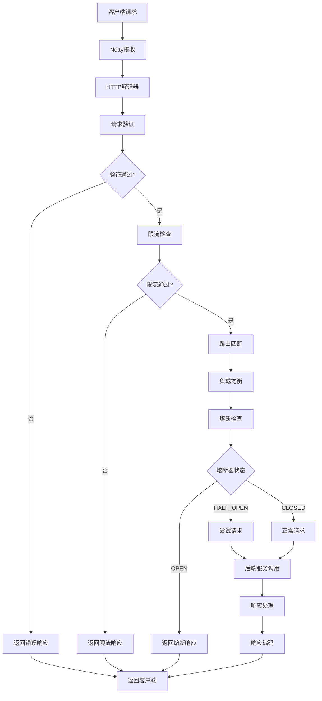
```mermaid
flowchart TD
    A[客户端请求] --> B[Netty接收]
    B --> C[HTTP解码器]
    C --> D[请求验证]
    D --> E{验证通过?}
    E -->|否| F[返回错误响应]
    E -->|是| G[限流检查]
    G --> H{限流通过?}
    H -->|否| I[返回限流响应]
    H -->|是| J[路由匹配]
    J --> K[负载均衡]
    K --> L[熔断检查]
    L --> M{熔断器状态}
    M -->|OPEN| N[返回熔断响应]
    M -->|HALF_OPEN| O[尝试请求]
    M -->|CLOSED| P[正常请求]
    O --> Q[后端服务调用]
    P --> Q
    Q --> R[响应处理]
    R --> S[响应编码]
    S --> T[返回客户端]
    F --> T
    I --> T
    N --> T
```

### 1.2 请求处理时序图

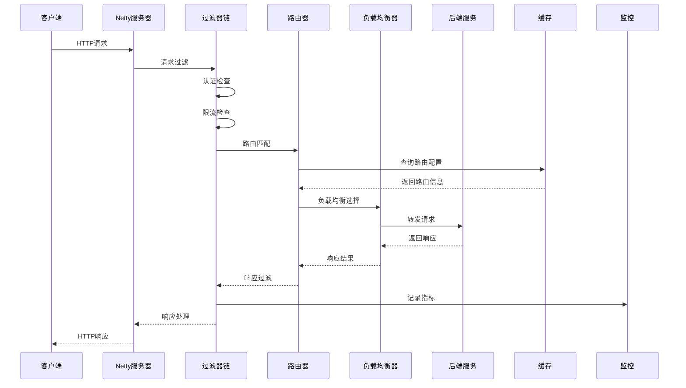
```mermaid
sequenceDiagram
    participant Client as 客户端
    participant Netty as Netty服务器
    participant Filter as 过滤器链
    participant Router as 路由器
    participant LB as 负载均衡器
    participant Backend as 后端服务
    participant Cache as 缓存
    participant Monitor as 监控

    Client->>Netty: HTTP请求
    Netty->>Filter: 请求过滤
    Filter->>Filter: 认证检查
    Filter->>Filter: 限流检查
    Filter->>Router: 路由匹配
    Router->>Cache: 查询路由配置
    Cache-->>Router: 返回路由信息
    Router->>LB: 负载均衡选择
    LB->>Backend: 转发请求
    Backend-->>LB: 返回响应
    LB-->>Router: 响应结果
    Router-->>Filter: 响应过滤
    Filter->>Monitor: 记录指标
    Filter-->>Netty: 响应处理
    Netty-->>Client: HTTP响应
```

## 2. 路由管理模块

### 2.1 路由管理流程图

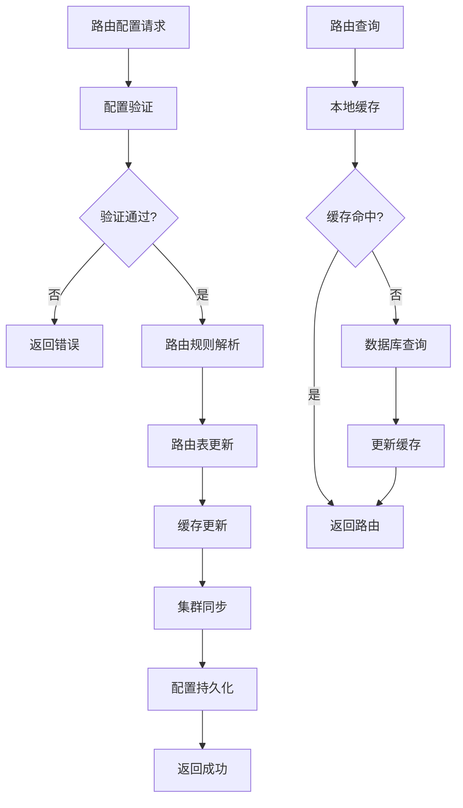
```mermaid
flowchart TD
    A[路由配置请求] --> B[配置验证]
    B --> C{验证通过?}
    C -->|否| D[返回错误]
    C -->|是| E[路由规则解析]
    E --> F[路由表更新]
    F --> G[缓存更新]
    G --> H[集群同步]
    H --> I[配置持久化]
    I --> J[返回成功]
    
    K[路由查询] --> L[本地缓存]
    L --> M{缓存命中?}
    M -->|是| N[返回路由]
    M -->|否| O[数据库查询]
    O --> P[更新缓存]
    P --> N
```

### 2.2 路由匹配算法

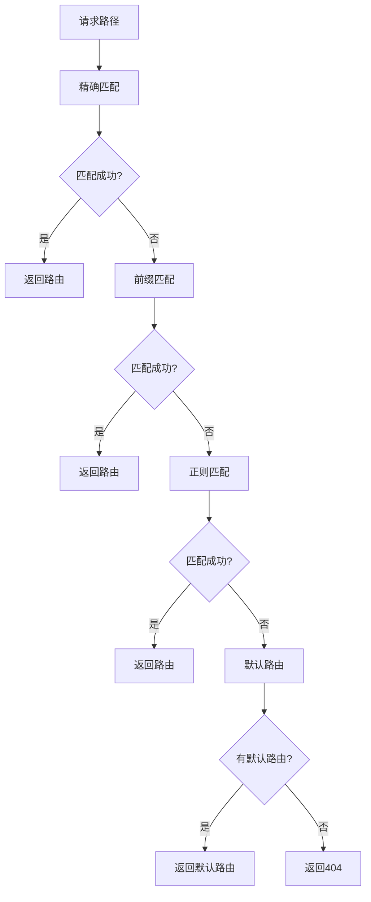
```mermaid
flowchart TD
    A[请求路径] --> B[精确匹配]
    B --> C{匹配成功?}
    C -->|是| D[返回路由]
    C -->|否| E[前缀匹配]
    E --> F{匹配成功?}
    F -->|是| G[返回路由]
    F -->|否| H[正则匹配]
    H --> I{匹配成功?}
    I -->|是| J[返回路由]
    I -->|否| K[默认路由]
    K --> L{有默认路由?}
    L -->|是| M[返回默认路由]
    L -->|否| N[返回404]
```

## 3. 负载均衡模块

### 3.1 负载均衡策略选择

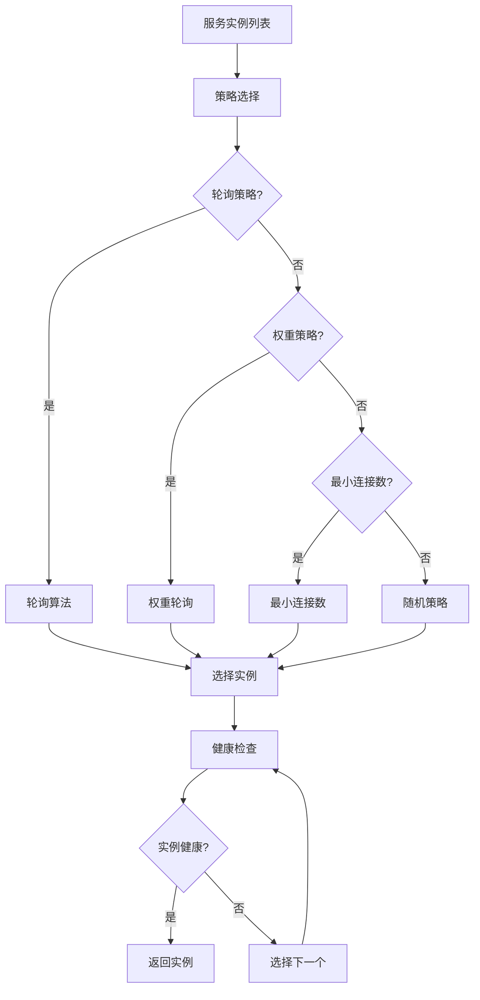
```mermaid
flowchart TD
    A[服务实例列表] --> B[策略选择]
    B --> C{轮询策略?}
    C -->|是| D[轮询算法]
    C -->|否| E{权重策略?}
    E -->|是| F[权重轮询]
    E -->|否| G{最小连接数?}
    G -->|是| H[最小连接数]
    G -->|否| I[随机策略]
    
    D --> J[选择实例]
    F --> J
    H --> J
    I --> J
    
    J --> K[健康检查]
    K --> L{实例健康?}
    L -->|是| M[返回实例]
    L -->|否| N[选择下一个]
    N --> K
```

### 3.2 权重轮询算法实现

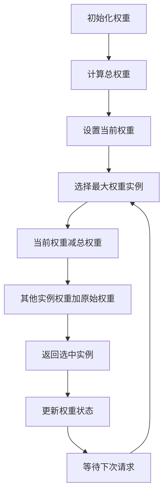
```mermaid
flowchart TD
    A[初始化权重] --> B[计算总权重]
    B --> C[设置当前权重]
    C --> D[选择最大权重实例]
    D --> E[当前权重减总权重]
    E --> F[其他实例权重加原始权重]
    F --> G[返回选中实例]
    G --> H[更新权重状态]
    H --> I[等待下次请求]
    I --> D
```

## 4. 限流模块

### 4.1 限流处理流程图

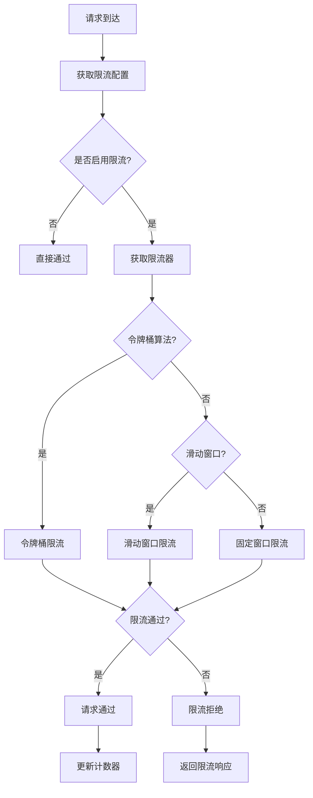
```mermaid
flowchart TD
    A[请求到达] --> B[获取限流配置]
    B --> C{是否启用限流?}
    C -->|否| D[直接通过]
    C -->|是| E[获取限流器]
    E --> F{令牌桶算法?}
    F -->|是| G[令牌桶限流]
    F -->|否| H{滑动窗口?}
    H -->|是| I[滑动窗口限流]
    H -->|否| J[固定窗口限流]
    
    G --> K{限流通过?}
    I --> K
    J --> K
    
    K -->|是| L[请求通过]
    K -->|否| M[限流拒绝]
    
    L --> N[更新计数器]
    M --> O[返回限流响应]
```

### 4.2 令牌桶限流算法

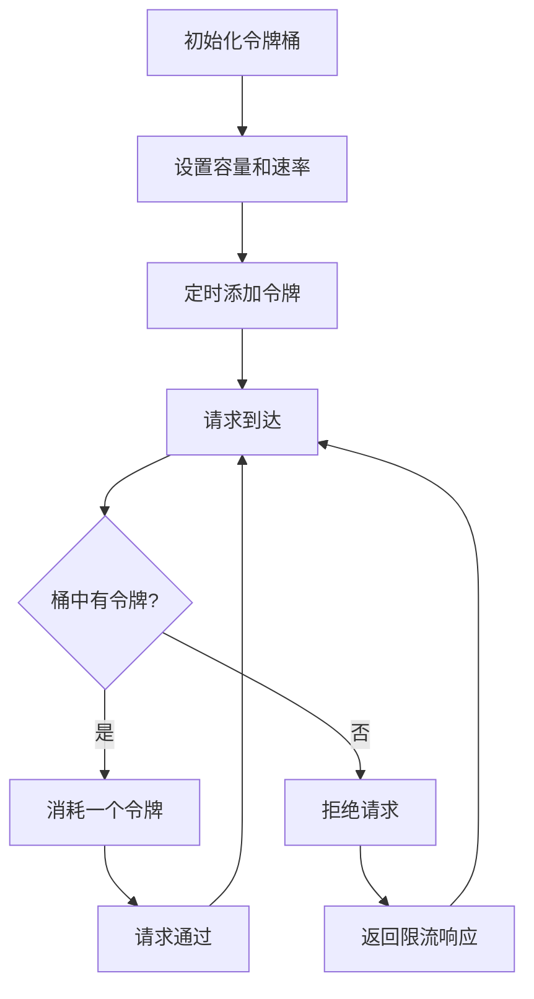
```mermaid
flowchart TD
    A[初始化令牌桶] --> B[设置容量和速率]
    B --> C[定时添加令牌]
    C --> D[请求到达]
    D --> E{桶中有令牌?}
    E -->|是| F[消耗一个令牌]
    E -->|否| G[拒绝请求]
    F --> H[请求通过]
    G --> I[返回限流响应]
    H --> D
    I --> D
```

## 5. 熔断器模块

### 5.1 熔断器状态转换图

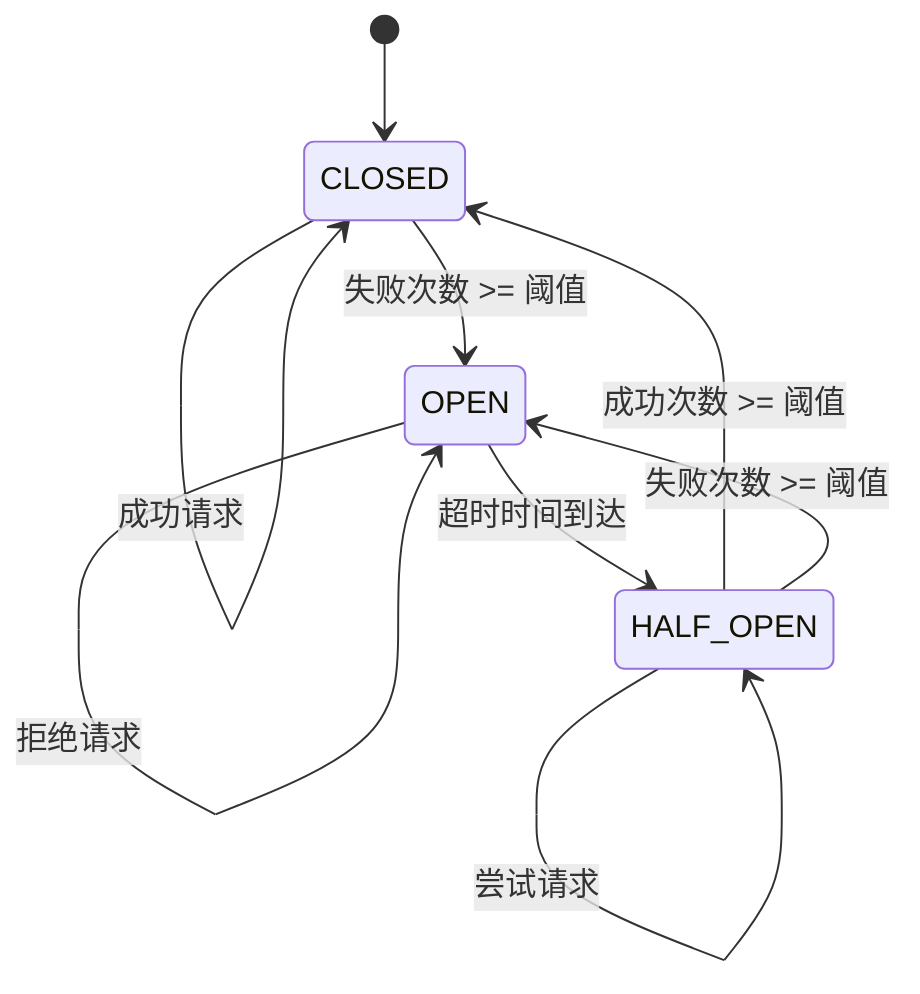
```mermaid
stateDiagram-v2
    [*] --> CLOSED
    CLOSED --> OPEN : 失败次数 >= 阈值
    OPEN --> HALF_OPEN : 超时时间到达
    HALF_OPEN --> CLOSED : 成功次数 >= 阈值
    HALF_OPEN --> OPEN : 失败次数 >= 阈值
    CLOSED --> CLOSED : 成功请求
    OPEN --> OPEN : 拒绝请求
    HALF_OPEN --> HALF_OPEN : 尝试请求
```

### 5.2 熔断器处理时序图

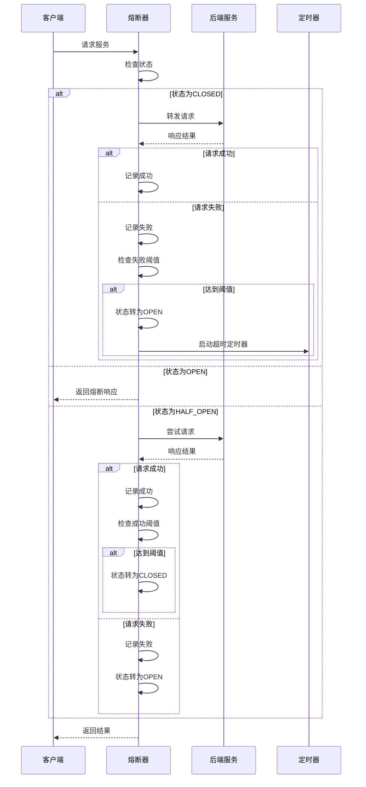
```mermaid
sequenceDiagram
    participant Client as 客户端
    participant CB as 熔断器
    participant Backend as 后端服务
    participant Timer as 定时器

    Client->>CB: 请求服务
    CB->>CB: 检查状态
    alt 状态为CLOSED
        CB->>Backend: 转发请求
        Backend-->>CB: 响应结果
        alt 请求成功
            CB->>CB: 记录成功
        else 请求失败
            CB->>CB: 记录失败
            CB->>CB: 检查失败阈值
            alt 达到阈值
                CB->>CB: 状态转为OPEN
                CB->>Timer: 启动超时定时器
            end
        end
    else 状态为OPEN
        CB-->>Client: 返回熔断响应
    else 状态为HALF_OPEN
        CB->>Backend: 尝试请求
        Backend-->>CB: 响应结果
        alt 请求成功
            CB->>CB: 记录成功
            CB->>CB: 检查成功阈值
            alt 达到阈值
                CB->>CB: 状态转为CLOSED
            end
        else 请求失败
            CB->>CB: 记录失败
            CB->>CB: 状态转为OPEN
        end
    end
    CB-->>Client: 返回结果
```

## 6. 缓存模块

### 6.1 多级缓存架构

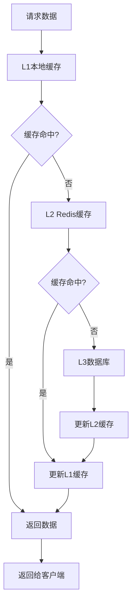
```mermaid
flowchart TD
    A[请求数据] --> B[L1本地缓存]
    B --> C{缓存命中?}
    C -->|是| D[返回数据]
    C -->|否| E[L2 Redis缓存]
    E --> F{缓存命中?}
    F -->|是| G[更新L1缓存]
    F -->|否| H[L3数据库]
    G --> D
    H --> I[更新L2缓存]
    I --> G
    D --> J[返回给客户端]
```

### 6.2 缓存更新策略

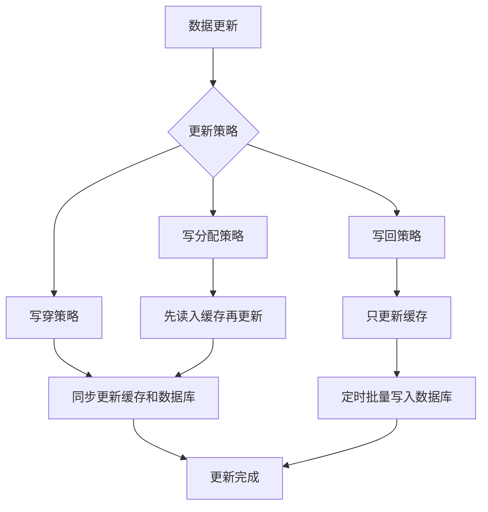
```mermaid
flowchart TD
    A[数据更新] --> B{更新策略}
    B --> C[写穿策略]
    B --> D[写回策略]
    B --> E[写分配策略]
    
    C --> F[同步更新缓存和数据库]
    D --> G[只更新缓存]
    E --> H[先读入缓存再更新]
    
    F --> I[更新完成]
    G --> J[定时批量写入数据库]
    H --> F
    
    J --> I
```

## 7. 监控模块

### 7.1 监控数据收集流程

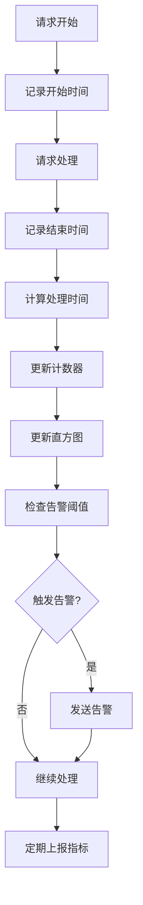
```mermaid
flowchart TD
    A[请求开始] --> B[记录开始时间]
    B --> C[请求处理]
    C --> D[记录结束时间]
    D --> E[计算处理时间]
    E --> F[更新计数器]
    F --> G[更新直方图]
    G --> H[检查告警阈值]
    H --> I{触发告警?}
    I -->|是| J[发送告警]
    I -->|否| K[继续处理]
    J --> K
    K --> L[定期上报指标]
```

### 7.2 监控指标上报时序图

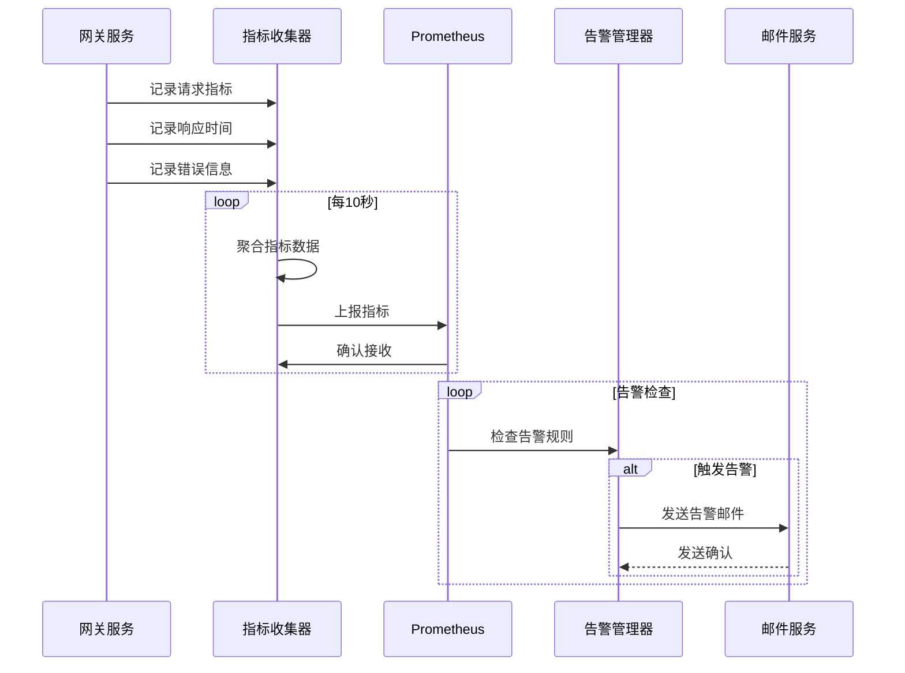
```mermaid
sequenceDiagram
    participant Gateway as 网关服务
    participant Collector as 指标收集器
    participant Prometheus as Prometheus
    participant AlertManager as 告警管理器
    participant Email as 邮件服务

    Gateway->>Collector: 记录请求指标
    Gateway->>Collector: 记录响应时间
    Gateway->>Collector: 记录错误信息
    
    loop 每10秒
        Collector->>Collector: 聚合指标数据
        Collector->>Prometheus: 上报指标
        Prometheus->>Collector: 确认接收
    end
    
    loop 告警检查
        Prometheus->>AlertManager: 检查告警规则
        alt 触发告警
            AlertManager->>Email: 发送告警邮件
            Email-->>AlertManager: 发送确认
        end
    end
```

## 8. 配置管理模块

### 8.1 配置热更新流程

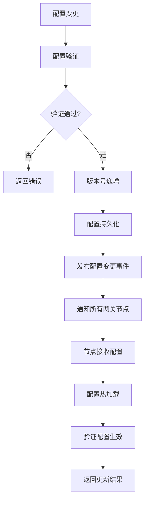
```mermaid
flowchart TD
    A[配置变更] --> B[配置验证]
    B --> C{验证通过?}
    C -->|否| D[返回错误]
    C -->|是| E[版本号递增]
    E --> F[配置持久化]
    F --> G[发布配置变更事件]
    G --> H[通知所有网关节点]
    H --> I[节点接收配置]
    I --> J[配置热加载]
    J --> K[验证配置生效]
    K --> L[返回更新结果]
```

### 8.2 配置同步时序图

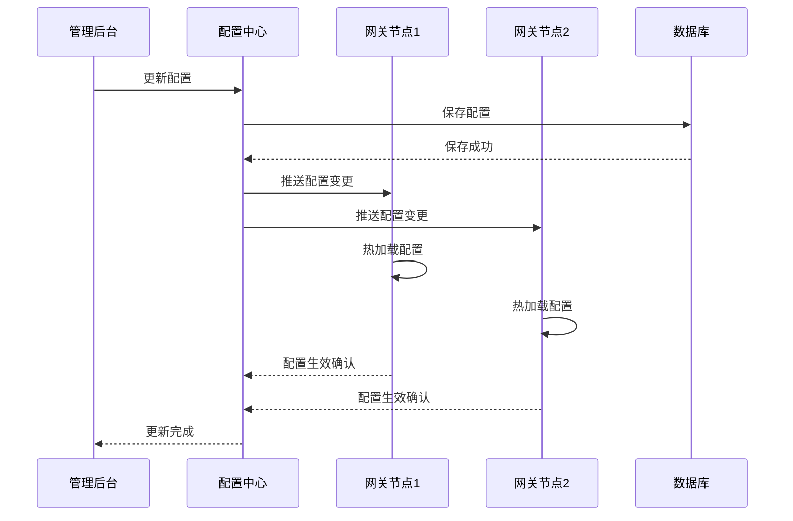
```mermaid
sequenceDiagram
    participant Admin as 管理后台
    participant Center as 配置中心
    participant Gateway1 as 网关节点1
    participant Gateway2 as 网关节点2
    participant DB as 数据库

    Admin->>Center: 更新配置
    Center->>DB: 保存配置
    DB-->>Center: 保存成功
    Center->>Gateway1: 推送配置变更
    Center->>Gateway2: 推送配置变更
    Gateway1->>Gateway1: 热加载配置
    Gateway2->>Gateway2: 热加载配置
    Gateway1-->>Center: 配置生效确认
    Gateway2-->>Center: 配置生效确认
    Center-->>Admin: 更新完成
```

## 9. 认证授权模块

### 9.1 认证流程

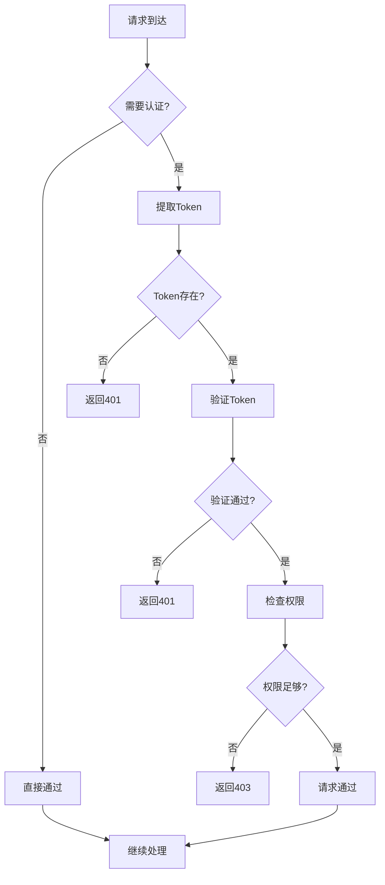
```mermaid
flowchart TD
    A[请求到达] --> B{需要认证?}
    B -->|否| C[直接通过]
    B -->|是| D[提取Token]
    D --> E{Token存在?}
    E -->|否| F[返回401]
    E -->|是| G[验证Token]
    G --> H{验证通过?}
    H -->|否| I[返回401]
    H -->|是| J[检查权限]
    J --> K{权限足够?}
    K -->|否| L[返回403]
    K -->|是| M[请求通过]
    C --> N[继续处理]
    M --> N
```

### 9.2 JWT认证时序图

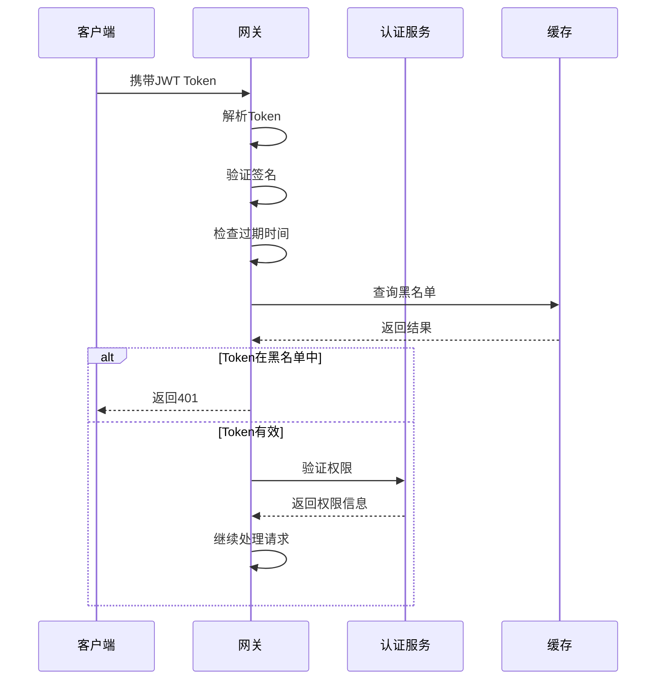
```mermaid
sequenceDiagram
    participant Client as 客户端
    participant Gateway as 网关
    participant Auth as 认证服务
    participant Cache as 缓存

    Client->>Gateway: 携带JWT Token
    Gateway->>Gateway: 解析Token
    Gateway->>Gateway: 验证签名
    Gateway->>Gateway: 检查过期时间
    Gateway->>Cache: 查询黑名单
    Cache-->>Gateway: 返回结果
    alt Token在黑名单中
        Gateway-->>Client: 返回401
    else Token有效
        Gateway->>Auth: 验证权限
        Auth-->>Gateway: 返回权限信息
        Gateway->>Gateway: 继续处理请求
    end
```

## 10. 日志模块

### 10.1 日志处理流程

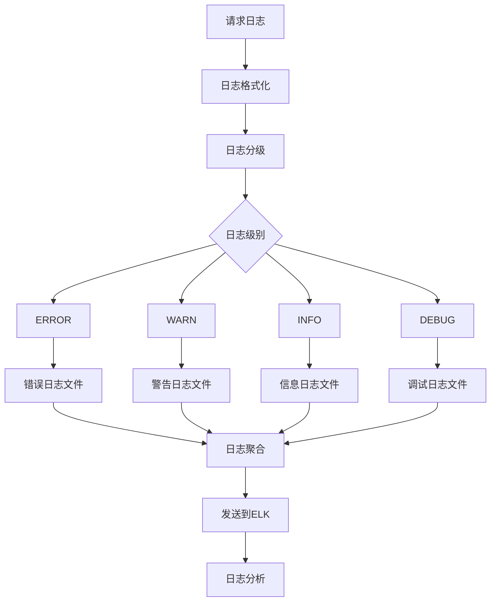
```mermaid
flowchart TD
    A[请求日志] --> B[日志格式化]
    B --> C[日志分级]
    C --> D{日志级别}
    D --> E[ERROR]
    D --> F[WARN]
    D --> G[INFO]
    D --> H[DEBUG]
    
    E --> I[错误日志文件]
    F --> J[警告日志文件]
    G --> K[信息日志文件]
    H --> L[调试日志文件]
    
    I --> M[日志聚合]
    J --> M
    K --> M
    L --> M
    
    M --> N[发送到ELK]
    N --> O[日志分析]
```

### 10.2 日志收集架构

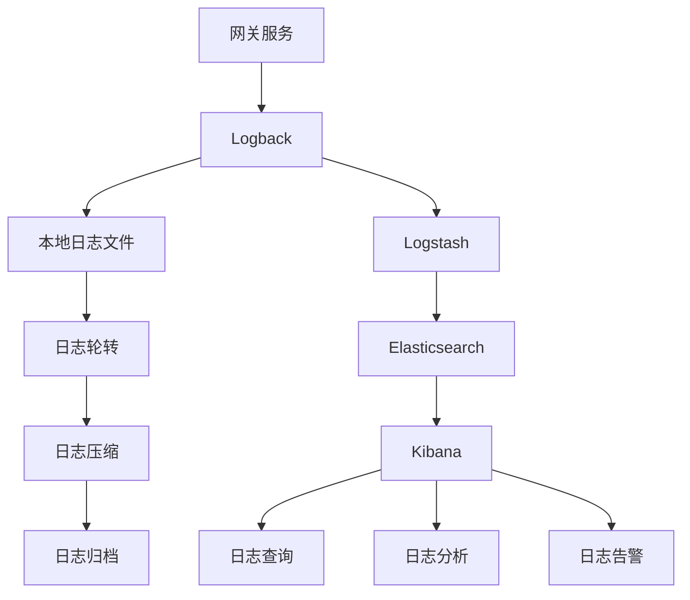
```mermaid
flowchart TD
    A[网关服务] --> B[Logback]
    B --> C[本地日志文件]
    B --> D[Logstash]
    D --> E[Elasticsearch]
    E --> F[Kibana]
    
    C --> G[日志轮转]
    G --> H[日志压缩]
    H --> I[日志归档]
    
    F --> J[日志查询]
    F --> K[日志分析]
    F --> L[日志告警]
```

## 11. 性能优化模块

### 11.1 线程池优化策略

```mermaid
flowchart TD
    A[请求到达] --> B[IO线程池]
    B --> C[业务线程池]
    C --> D[定时任务线程池]
    
    B --> E[网络IO处理]
    C --> F[业务逻辑处理]
    D --> G[定时任务执行]
    
    E --> H[异步处理]
    F --> I[同步处理]
    G --> J[后台任务]
    
    H --> K[响应返回]
    I --> K
    J --> L[系统维护]
```

### 11.2 内存池管理

```mermaid
flowchart TD
    A[内存分配请求] --> B{池中有可用内存?}
    B -->|是| C[从池中分配]
    B -->|否| D[创建新内存块]
    C --> E[返回内存]
    D --> E
    
    F[内存释放] --> G[归还到池中]
    G --> H{池已满?}
    H -->|是| I[丢弃内存]
    H -->|否| J[保留在池中]
    
    I --> K[内存回收]
    J --> L[等待下次使用]
```

## 12. 集群管理模块

### 12.1 节点注册流程

```mermaid
flowchart TD
    A[节点启动] --> B[健康检查]
    B --> C{检查通过?}
    C -->|否| D[启动失败]
    C -->|是| E[注册到集群]
    E --> F[同步配置]
    F --> G[开始服务]
    
    H[心跳检测] --> I{心跳正常?}
    I -->|是| J[继续服务]
    I -->|否| K[标记异常]
    K --> L[尝试恢复]
    L --> M{恢复成功?}
    M -->|是| J
    M -->|否| N[从集群移除]
```

### 12.2 集群通信时序图

```mermaid
sequenceDiagram
    participant Node1 as 节点1
    participant Node2 as 节点2
    participant Node3 as 节点3
    participant Center as 集群中心

    Node1->>Center: 注册节点
    Node2->>Center: 注册节点
    Node3->>Center: 注册节点
    
    Center->>Node1: 同步集群信息
    Center->>Node2: 同步集群信息
    Center->>Node3: 同步集群信息
    
    loop 心跳检测
        Node1->>Center: 心跳
        Node2->>Center: 心跳
        Node3->>Center: 心跳
        Center->>Node1: 心跳响应
        Center->>Node2: 心跳响应
        Center->>Node3: 心跳响应
    end
```

## 13. 安全防护模块

### 13.1 安全防护流程

```mermaid
flowchart TD
    A[请求到达] --> B[IP白名单检查]
    B --> C{IP允许?}
    C -->|否| D[拒绝访问]
    C -->|是| E[DDoS防护]
    E --> F{频率超限?}
    F -->|是| G[限流处理]
    F -->|否| H[SQL注入检查]
    H --> I{存在注入?}
    I -->|是| J[拒绝请求]
    I -->|否| K[XSS检查]
    K --> L{存在XSS?}
    L -->|是| M[过滤处理]
    L -->|否| N[继续处理]
    
    D --> O[返回403]
    G --> O
    J --> O
    M --> N
```

### 13.2 安全防护时序图

```mermaid
sequenceDiagram
    participant Client as 客户端
    participant WAF as WAF防护
    participant Gateway as 网关
    participant Backend as 后端服务

    Client->>WAF: HTTP请求
    WAF->>WAF: IP白名单检查
    WAF->>WAF: DDoS检测
    WAF->>WAF: SQL注入检测
    WAF->>WAF: XSS检测
    
    alt 安全检查通过
        WAF->>Gateway: 转发请求
        Gateway->>Backend: 处理请求
        Backend-->>Gateway: 返回响应
        Gateway-->>WAF: 响应结果
        WAF-->>Client: 返回响应
    else 安全检查失败
        WAF-->>Client: 返回错误响应
    end
```

## 14. 链路追踪模块

### 14.1 链路追踪流程

```mermaid
flowchart TD
    A[请求开始] --> B[生成TraceId]
    B --> C[创建Span]
    C --> D[记录开始时间]
    D --> E[请求处理]
    E --> F[记录处理步骤]
    F --> G[调用后端服务]
    G --> H[记录调用信息]
    H --> I[响应处理]
    I --> J[记录结束时间]
    J --> K[计算耗时]
    K --> L[上报链路数据]
    L --> M[链路分析]
```

### 14.2 链路追踪时序图

```mermaid
sequenceDiagram
    participant Client as 客户端
    participant Gateway as 网关
    participant Backend1 as 用户服务
    participant Backend2 as 订单服务
    participant Trace as 链路追踪

    Client->>Gateway: 请求(TraceId: abc123)
    Gateway->>Trace: 创建Span(gateway-span)
    Gateway->>Backend1: 调用用户服务(TraceId: abc123)
    Backend1->>Trace: 创建Span(user-span)
    Backend1-->>Gateway: 返回用户信息
    Gateway->>Backend2: 调用订单服务(TraceId: abc123)
    Backend2->>Trace: 创建Span(order-span)
    Backend2-->>Gateway: 返回订单信息
    Gateway->>Trace: 完成Span(gateway-span)
    Gateway-->>Client: 返回完整响应
    Trace->>Trace: 聚合链路数据
```

## 总结

这些流程图和时序图详细展示了API网关各个子功能模块的设计和实现方式，包括：

1. **请求处理流程** - 完整的请求生命周期管理
2. **路由管理** - 智能路由配置和匹配算法
3. **负载均衡** - 多种负载均衡策略实现
4. **限流模块** - 令牌桶等高效限流算法
5. **熔断器** - 状态转换和故障保护机制
6. **缓存系统** - 多级缓存架构设计
7. **监控系统** - 实时指标收集和告警
8. **配置管理** - 热更新和集群同步机制
9. **认证授权** - JWT认证和权限控制
10. **日志系统** - 分布式日志收集和分析
11. **性能优化** - 线程池和内存管理优化
12. **集群管理** - 节点注册和健康检查
13. **安全防护** - 多层安全防护机制
14. **链路追踪** - 分布式链路追踪

每个模块都采用了异步非阻塞的设计，确保系统能够承载百万级QPS的流量，同时提供高可用性和可扩展性。