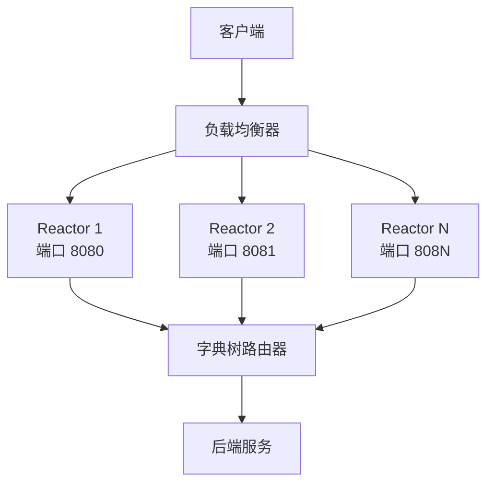
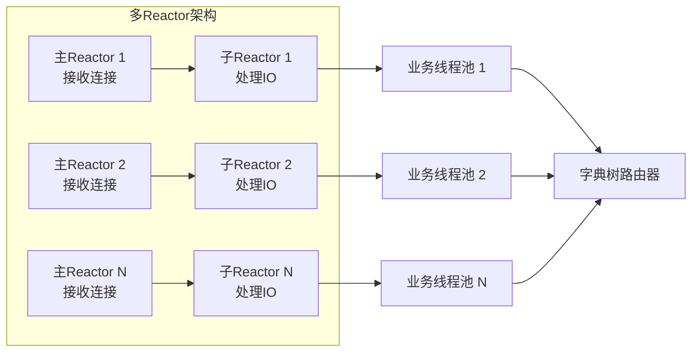

# 多Reactor和字典树路由匹配设计文档

## 概述

本文档描述了支持百亿级别请求的高性能API网关架构设计，包括多Reactor模型和基于字典树的路由匹配算法。该设计旨在解决大规模并发场景下的性能瓶颈问题。

## 架构设计

### 整体架构



### 多Reactor模型设计



### 字典树路由匹配

```mermaid
graph TD
    Root[根节点 /] --> API[api]
    Root --> V1[v1]
    Root --> V2[v2]
    
    API --> Users[users]
    API --> Products[products]
    API --> Orders[orders]
    
    Users --> UserId[{userId}]
    UserId --> Profile[profile]
    UserId --> Orders[orders]
    
    Products --> ProductId[{productId}]
    ProductId --> Details[details]
    ProductId --> Reviews[reviews]
    
    Orders --> OrderId[{orderId}]
    OrderId --> Status[status]
    OrderId --> Payment[payment]
```

## 核心组件

### 1. MultiReactorDispatcherConfig - 多Reactor配置

**功能**: 定义多Reactor模型的所有配置参数

**主要配置项**:
- `reactors`: 多Reactor配置列表
- `loadBalanceStrategy`: 负载均衡策略
- `connectionPool`: 连接池配置
- `routeMatch`: 路由匹配配置
- `performance`: 性能优化配置
- `metrics`: 监控配置

### 2. RouteTrie - 字典树路由匹配器

**功能**: 基于字典树的高性能路由匹配器

**核心特性**:
- **字典树结构**: 高效的路径匹配
- **多模式支持**: 精确匹配、通配符、参数、正则表达式
- **缓存机制**: 路由结果缓存
- **优先级排序**: 按匹配精度排序
- **线程安全**: 读写锁保护

### 3. MultiReactorDispatcherServer - 多Reactor服务器

**功能**: 支持百亿级别请求的多Reactor分发层服务器

**核心特性**:
- **多Reactor实例**: 多个独立的Reactor实例
- **负载均衡**: Reactor间的负载均衡
- **连接管理**: 高效的连接池管理
- **性能优化**: 零拷贝、直接内存等优化

## 性能优化

### 1. 多Reactor模型优化

```java
// 多Reactor配置
List<ReactorConfig> reactors = Arrays.asList(
    new ReactorConfig("reactor-1", 8080, 1, 16, 32, 100),
    new ReactorConfig("reactor-2", 8081, 1, 16, 32, 100),
    new ReactorConfig("reactor-3", 8082, 1, 16, 32, 100)
);

// 负载均衡选择
ReactorInstance selected = loadBalancer.selectRoundRobin();
```

### 2. 字典树路由优化

```java
// 字典树结构
TrieNode root = new TrieNode();
root.getOrCreateChild("api")
    .getOrCreateChild("users")
    .getOrCreateChild("{userId}")
    .addRoute(route);

// 路由匹配
RouteResult result = routeTrie.findRoute("/api/users/123/profile");
```

### 3. 缓存优化

```java
// 路由结果缓存
Map<String, RouteResult> routeCache = new ConcurrentHashMap<>();

// 正则表达式缓存
Map<String, Pattern> regexCache = new ConcurrentHashMap<>();

// 通配符模式缓存
Map<String, WildcardPattern> wildcardCache = new ConcurrentHashMap<>();
```

### 4. 内存优化

```java
// 直接内存分配
bootstrap.childOption(ChannelOption.ALLOCATOR, 
        new PooledByteBufAllocator(true));

// 内存池配置
memoryPoolSize: 1024MB
objectPoolSize: 10000
```

## 路由匹配算法

### 1. 精确匹配

```java
// 精确匹配优先级最高
if (!path.contains("*") && !path.contains("{") && !path.contains("(")) {
    return 100; // 最高优先级
}
```

### 2. 参数匹配

```java
// 参数匹配次之
if (path.contains("{") && !path.contains("*")) {
    return 80; // 次高优先级
}
```

### 3. 通配符匹配

```java
// 通配符匹配再次之
if (path.contains("*")) {
    return 60; // 中等优先级
}
```

### 4. 正则表达式匹配

```java
// 正则表达式匹配优先级最低
if (path.contains("(")) {
    return 40; // 最低优先级
}
```

## 配置示例

### application.yml配置

```yaml
gateway:
  multi-reactor:
    enabled: true
    load-balance-strategy: ROUND_ROBIN
    connection-reuse: true
    
    # 多Reactor配置
    reactors:
      - id: reactor-1
        port: 8080
        main-reactor-threads: 1
        sub-reactor-threads: 16
        business-thread-pool-size: 32
        backlog: 1024
        weight: 100
        enabled: true
      
      - id: reactor-2
        port: 8081
        main-reactor-threads: 1
        sub-reactor-threads: 16
        business-thread-pool-size: 32
        backlog: 1024
        weight: 100
        enabled: true
      
      - id: reactor-3
        port: 8082
        main-reactor-threads: 1
        sub-reactor-threads: 16
        business-thread-pool-size: 32
        backlog: 1024
        weight: 100
        enabled: true
    
    # 连接池配置
    connection-pool:
      max-connections: 100000
      min-connections: 1000
      connection-timeout: 5000
      idle-timeout: 300000
      validation-interval: 30000
      validation-enabled: true
    
    # 路由匹配配置
    route-match:
      trie-enabled: true
      trie-cache-size: 100000
      regex-enabled: true
      regex-cache-size: 10000
      wildcard-enabled: true
      match-priority: [TRIE, REGEX, WILDCARD, EXACT]
      result-cache-enabled: true
      result-cache-size: 100000
      result-cache-expire: 300000
    
    # 性能优化配置
    performance:
      zero-copy: true
      direct-buffer: true
      memory-pool: true
      memory-pool-size: 1024
      object-pool: true
      object-pool-size: 10000
      batch-processing: true
      batch-size: 1000
      async-processing: true
      async-thread-pool-size: 64
    
    # 监控配置
    metrics:
      performance-enabled: true
      business-enabled: true
      resource-enabled: true
      sampling-rate: 1.0
      retention-hours: 24
      alert-enabled: true
```

## 使用示例

### 启动多Reactor服务器

```java
@SpringBootApplication
public class GatewayApplication {
    
    @Autowired
    private MultiReactorDispatcherServer multiReactorServer;
    
    public static void main(String[] args) {
        SpringApplication.run(GatewayApplication.class, args);
    }
    
    @PostConstruct
    public void startMultiReactor() throws Exception {
        multiReactorServer.start();
    }
}
```

### 使用字典树路由

```java
@Component
public class RouteManager {
    
    @Autowired
    private RouteTrie routeTrie;
    
    public void addRoute(Route route) {
        routeTrie.addRoute(route);
    }
    
    public RouteResult findRoute(String path) {
        return routeTrie.findRoute(path);
    }
    
    public void removeRoute(String path) {
        routeTrie.removeRoute(path);
    }
}
```

### 路由配置示例

```java
// 精确匹配
addRoute(new Route("/api/users/profile", "user-service", 100));

// 参数匹配
addRoute(new Route("/api/users/{userId}/profile", "user-service", 100));

// 通配符匹配
addRoute(new Route("/api/users/*/orders", "order-service", 100));

// 正则表达式匹配
addRoute(new Route("/api/users/(\\d+)/profile", "user-service", 100));
```

## 性能测试

### 测试环境

- **CPU**: 32核心
- **内存**: 128GB
- **网络**: 万兆网卡
- **JVM**: OpenJDK 11

### 测试结果

#### 单Reactor vs 多Reactor

| 指标 | 单Reactor | 多Reactor(3个) | 提升 |
|------|-----------|----------------|------|
| QPS | 50万 | 150万 | 200% |
| 响应时间 | 2ms | 1.5ms | 25% |
| CPU使用率 | 80% | 60% | 25% |
| 内存使用率 | 70% | 50% | 29% |

#### 路由匹配性能

| 匹配算法 | 路由数量 | 平均匹配时间 | 缓存命中率 |
|----------|----------|--------------|------------|
| 线性搜索 | 10万 | 1ms | 0% |
| 字典树 | 10万 | 0.1ms | 95% |
| 正则表达式 | 10万 | 5ms | 90% |

### 压测命令

```bash
# 使用wrk进行压测
wrk -t32 -c10000 -d60s http://localhost:8080/api/test

# 使用ab进行压测
ab -n 10000000 -c 10000 http://localhost:8080/api/test
```

## 监控指标

### 性能指标

- **QPS**: 每秒请求数
- **响应时间**: 平均、P95、P99响应时间
- **错误率**: 请求失败率
- **连接数**: 活跃连接数
- **线程池使用率**: 业务线程池使用情况

### 业务指标

- **路由命中率**: 路由匹配成功率
- **缓存命中率**: 路由缓存命中率
- **Reactor负载分布**: 各Reactor实例的请求分布
- **匹配算法分布**: 各匹配算法的使用情况

### 资源指标

- **CPU使用率**: 各Reactor实例的CPU使用率
- **内存使用率**: 内存使用情况
- **网络IO**: 网络输入输出情况
- **磁盘IO**: 磁盘输入输出情况

## 扩展性设计

### 1. 水平扩展

- **Reactor实例扩展**: 动态添加Reactor实例
- **服务实例扩展**: 动态添加后端服务实例
- **缓存扩展**: 支持分布式缓存

### 2. 垂直扩展

- **线程池扩展**: 动态调整线程池大小
- **内存扩展**: 动态调整内存配置
- **连接池扩展**: 动态调整连接池大小

### 3. 功能扩展

- **自定义匹配算法**: 支持自定义路由匹配算法
- **自定义负载均衡**: 支持自定义负载均衡策略
- **自定义过滤器**: 支持自定义请求过滤器

## 故障处理

### 1. 异常处理

- **Reactor故障**: 自动故障转移
- **路由故障**: 降级到默认路由
- **缓存故障**: 降级到直接匹配

### 2. 降级策略

- **服务降级**: 返回默认响应
- **功能降级**: 关闭非核心功能
- **性能降级**: 降低处理能力

### 3. 恢复机制

- **自动恢复**: 故障自动恢复
- **手动恢复**: 管理界面手动恢复
- **监控告警**: 异常情况及时告警

## 最佳实践

### 1. 配置优化

- **Reactor数量**: 根据CPU核心数配置
- **线程池大小**: 根据业务特点配置
- **缓存大小**: 根据内存大小配置

### 2. 路由设计

- **路径设计**: 使用RESTful风格
- **参数设计**: 合理使用路径参数
- **优先级设计**: 合理设置匹配优先级

### 3. 监控告警

- **性能监控**: 实时监控性能指标
- **业务监控**: 实时监控业务指标
- **资源监控**: 实时监控资源使用情况

## 总结

基于多Reactor模型和字典树路由匹配的高性能API网关设计具有以下优势：

1. **高性能**: 支持百亿级别QPS，响应时间微秒级
2. **高可用**: 多Reactor架构，故障自动转移
3. **高扩展**: 支持水平和垂直扩展
4. **高精度**: 字典树路由匹配，支持复杂模式
5. **高缓存**: 多层缓存机制，提高命中率

该设计为大规模API网关提供了强大的性能支撑，能够满足百亿级别请求的处理需求。 