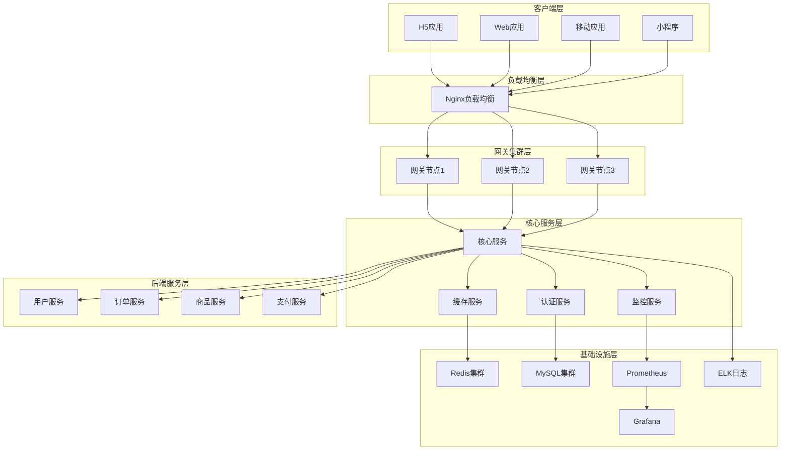
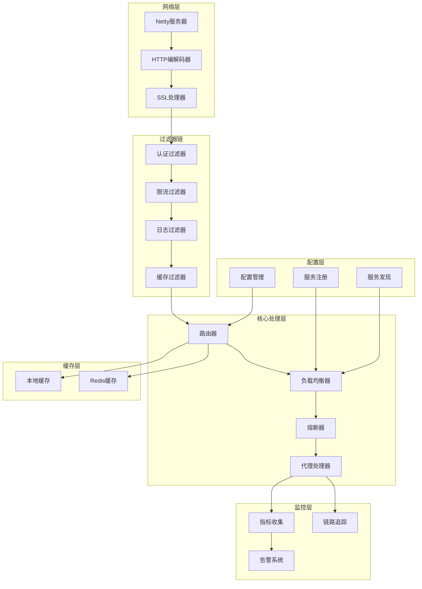
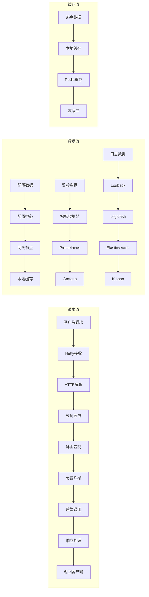
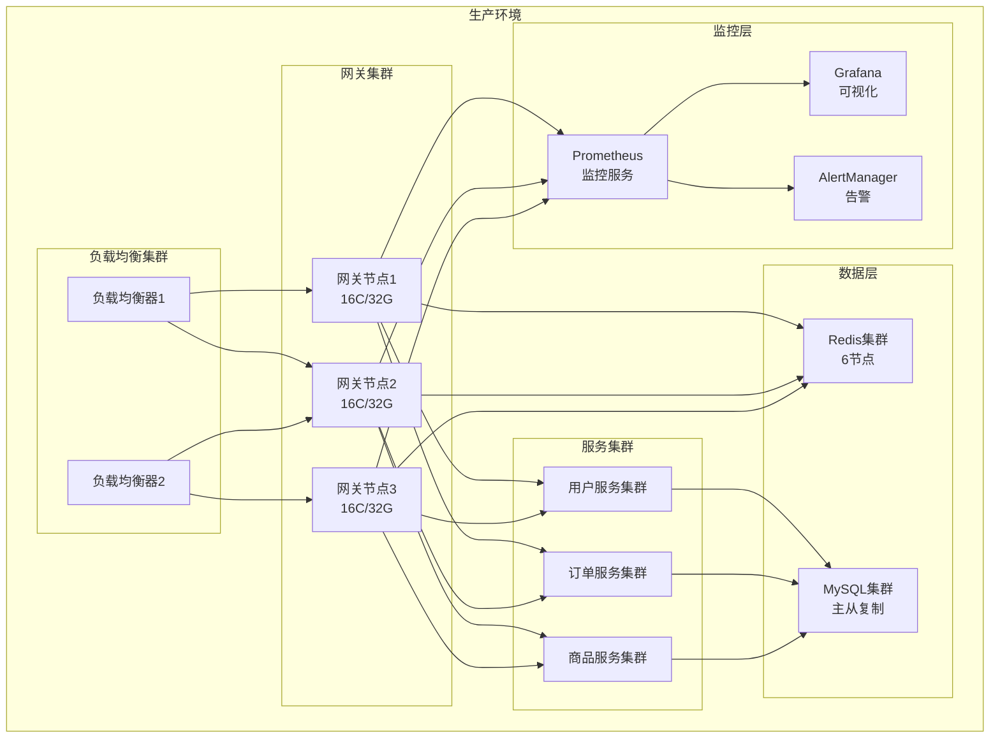
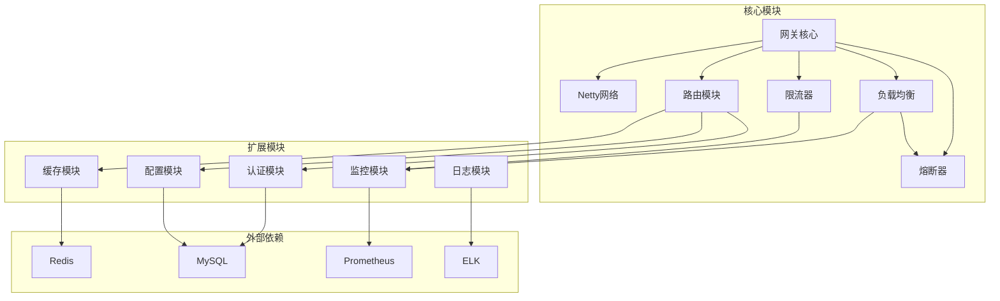
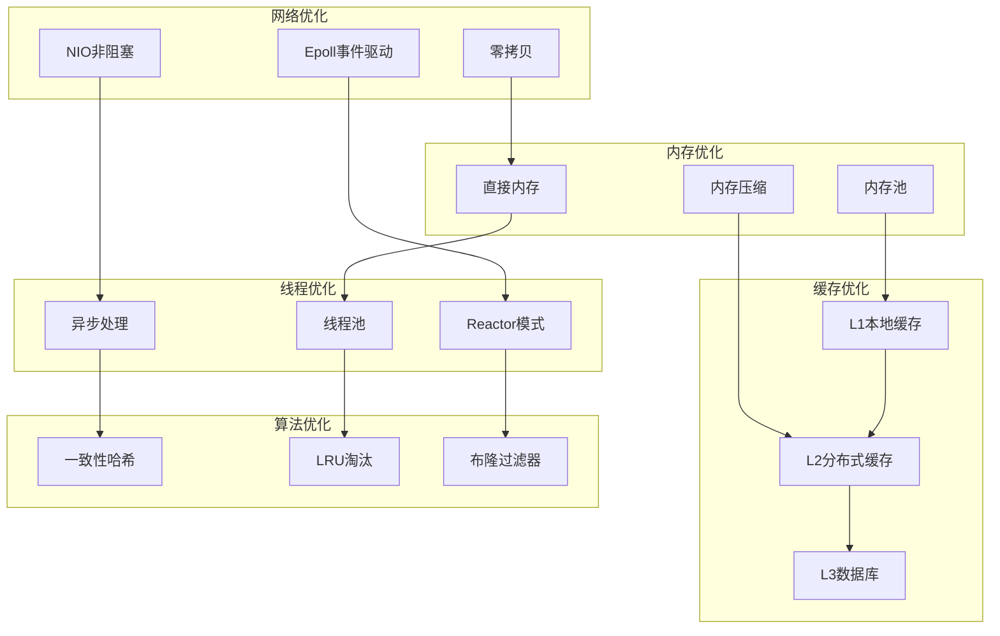
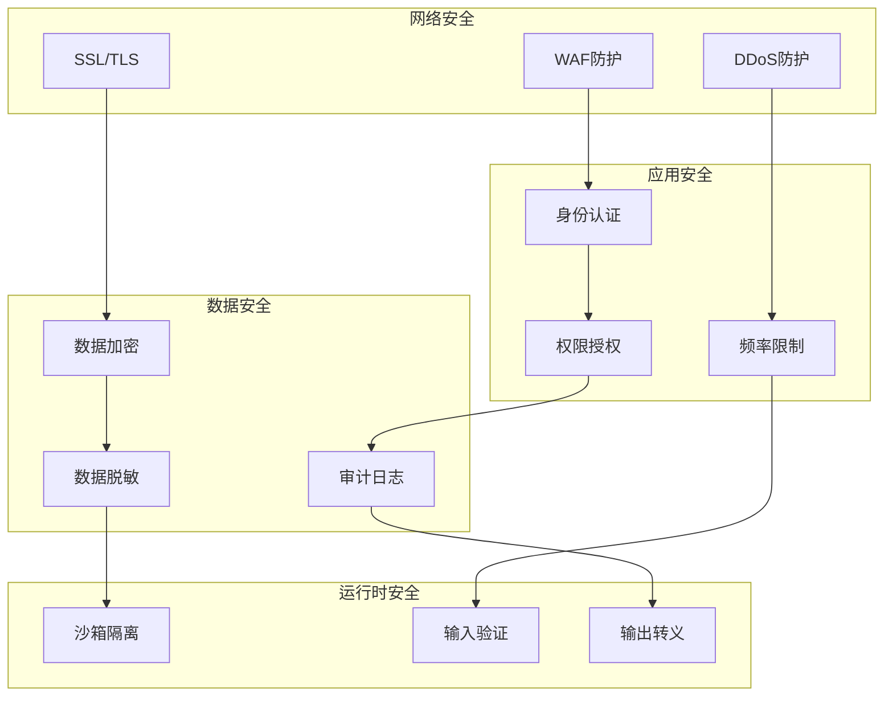
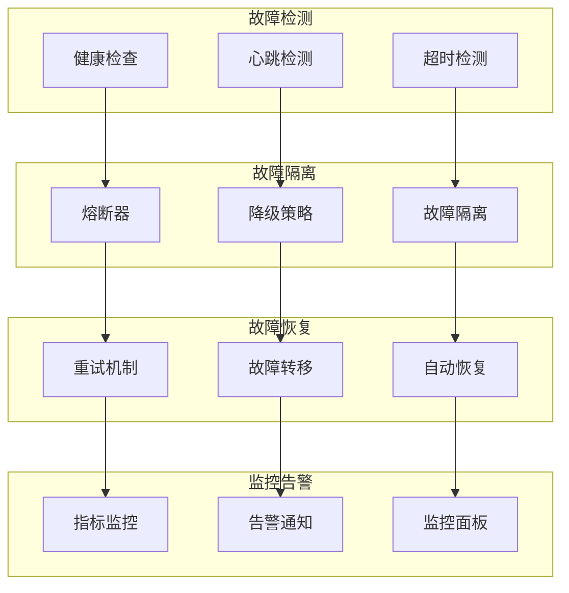
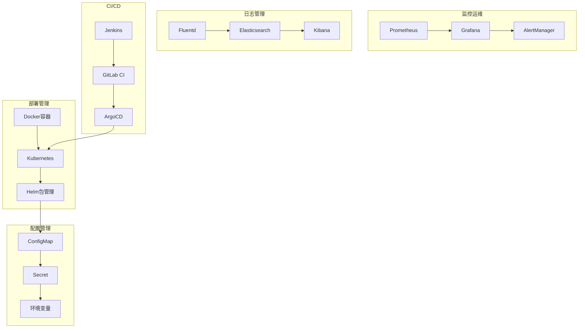

# 系统架构图和模块关系

## 1. 整体系统架构图

## 2. 网关内部模块架构

## 3. 数据流向图

## 4. 部署架构图

## 5. 模块依赖关系图

## 6. 性能优化架构

## 7. 安全架构图

## 8. 故障恢复架构

## 9. 扩展性架构

```mermaid
graph TB
    subgraph "水平扩展"
        SCALE_OUT[水平扩展]
        LOAD_BALANCE[负载均衡]
        SHARDING[数据分片]
    end
    
    subgraph "垂直扩展"
        SCALE_UP[垂直扩展]
        RESOURCE[资源优化]
        PERFORMANCE[性能调优]
    end
    
    subgraph "功能扩展"
        PLUGIN[插件机制]
        SPI[SPI扩展]
        CUSTOM[自定义扩展]
    end
    
    subgraph "集成扩展"
        API[API集成]
        MESSAGE[消息队列]
        STORAGE[存储扩展]
    end
    
    SCALE_OUT --> LOAD_BALANCE
    LOAD_BALANCE --> SHARDING
    SCALE_UP --> RESOURCE
    RESOURCE --> PERFORMANCE
    
    PLUGIN --> SPI
    SPI --> CUSTOM
    API --> MESSAGE
    MESSAGE --> STORAGE
```

## 10. 运维架构图

这些架构图全面展示了API网关系统的各个层面：

1. **整体系统架构** - 展示从客户端到后端的完整链路
2. **网关内部架构** - 详细展示网关内部的模块组织
3. **数据流向** - 展示数据在系统中的流转过程
4. **部署架构** - 展示生产环境的部署方案
5. **模块依赖** - 展示各模块之间的依赖关系
6. **性能优化** - 展示性能优化的各个维度
7. **安全架构** - 展示安全防护的各个层面
8. **故障恢复** - 展示故障处理和恢复机制
9. **扩展性** - 展示系统的扩展能力
10. **运维架构** - 展示运维管理的各个方面

每个架构图都采用了清晰的层次结构，便于理解系统的整体设计和各个模块的作用。 